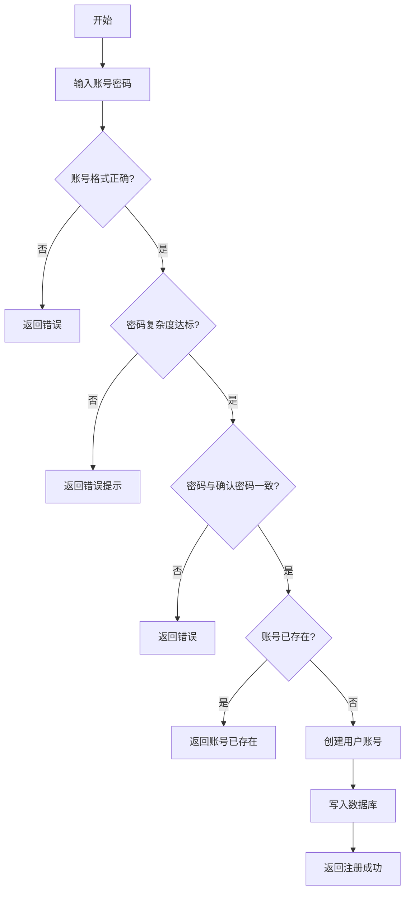
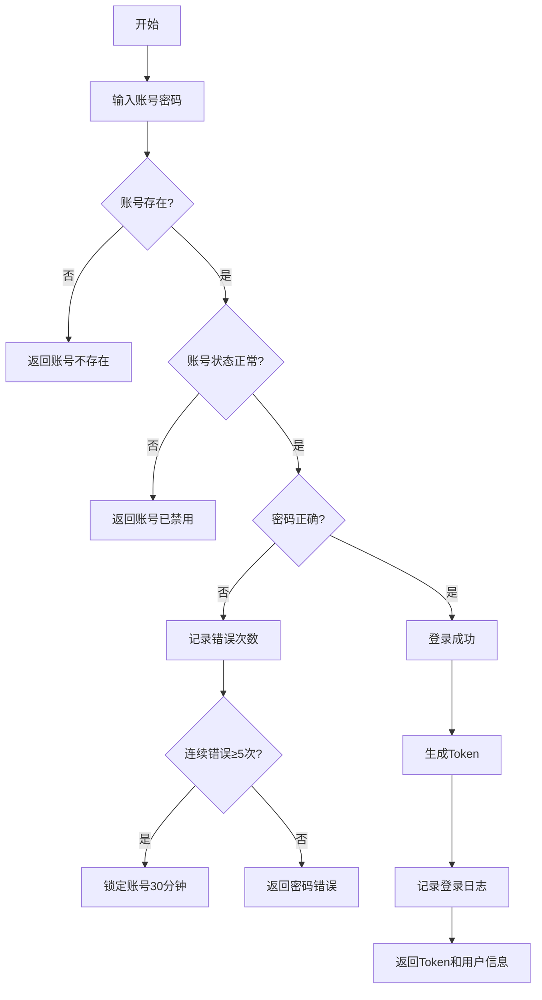
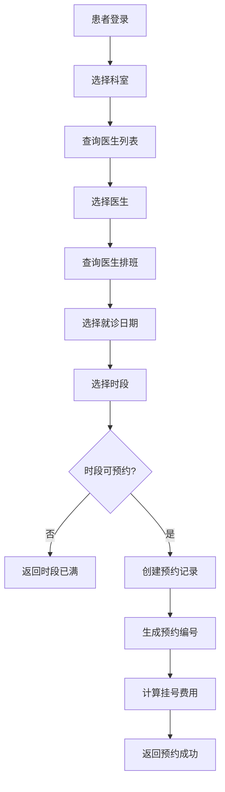
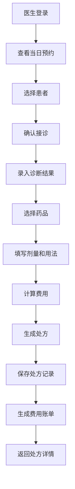
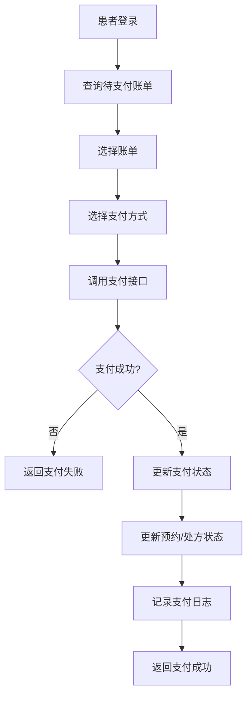

# 企业级医疗中心平台 - 传统业务模块需求分析文档

> **项目名称**：Medical Multi-Agent Healthcare Platform
>
> **文档版本**：V1.1
>
> **编制日期**：2026-05-12
>
> **编制依据**：基于Java多Agent Demo升级规划、Python版本参考实现、yu-picture-backend项目架构模式

***

## 目录

1. [文档概述](#1-文档概述)
2. [系统整体架构](#2-系统整体架构)
3. [用户（患者）管理系统](#3-用户患者管理系统)
4. [医生管理系统](#4-医生管理系统)
5. [管理员系统](#5-管理员系统)
6. [数据模型设计](#6-数据模型设计)
7. [接口设计](#7-接口设计)
8. [业务流程设计](#8-业务流程设计)
9. [权限与安全设计](#9-权限与安全设计)
10. [非功能需求](#10-非功能需求)
11. [需求优先级与里程碑](#11-需求优先级与里程碑)

***

## 1. 文档概述

### 1.1 目的与范围

本文档针对企业级医疗中心平台的传统业务模块进行需求分析，聚焦于：

- **普通用户（患者）管理系统**：用户注册、登录、个人信息管理、问诊记录查看等
- **医生管理系统**：医生信息管理、排班管理、处方开具、诊疗记录等
- **管理员系统**：用户管理、医生管理、权限管理、系统配置、审计日志等

本阶段暂不涉及多Agent问诊服务的实现，仅完成传统业务模块的架构设计。

### 1.2 设计原则

| 原则         | 说明                                 |
| ---------- | ---------------------------------- |
| **参考成熟架构** | 借鉴yu-picture-backend项目的分层架构和设计模式   |
| **高内聚低耦合** | 清晰的模块划分，模块间通过接口交互                  |
| **安全优先**   | 医疗数据敏感，严格遵循HIPAA安全规范               |
| **可扩展性**   | 预留与多Agent问诊系统的集成接口                 |
| **单一用户表**  | 普通用户与管理员共用一张user表，通过userRole字段区分角色 |
| **非强制外键**  | 表间关联通过业务逻辑维护，不使用强制外键约束             |

### 1.3 术语定义

| 术语              | 定义                                    |
| --------------- | ------------------------------------- |
| **User（用户）**    | 平台注册用户，包括普通患者和管理员，通过userRole字段区分      |
| **Patient（患者）** | userRole=user的普通用户，通过平台进行问诊咨询         |
| **Doctor（医生）**  | 平台认证的执业医师，提供诊疗服务                      |
| **Admin（管理员）**  | userRole=admin的用户，负责用户管理、系统配置         |
| **PHI**         | Protected Health Information，受保护的健康信息 |
| **VO**          | View Object，视图对象，用于前端展示               |
| **DTO**         | Data Transfer Object，数据传输对象           |

***

## 2. 系统整体架构

### 2.1 技术架构参考

参考yu-picture-backend项目的分层架构，采用经典的三层架构设计：

```
┌─────────────────────────────────────────────────────────────┐
│                      Controller 层                          │
│   (UserController, DoctorController, AdminController, 等)    │
├─────────────────────────────────────────────────────────────┤
│                       Service 层                            │
│   (UserService, DoctorService, AdminService, 等)            │
├─────────────────────────────────────────────────────────────┤
│                       Mapper 层                             │
│         (MyBatis-Plus 自动生成 CRUD)                        │
├─────────────────────────────────────────────────────────────┤
│                      MySQL 数据库                           │
│              (PostgreSQL - 医疗数据存储)                    │
└─────────────────────────────────────────────────────────────┘
```

### 2.2 项目模块划分

| 模块名称             | 职责说明                    |
| ---------------- | ----------------------- |
| **controller**   | 接收HTTP请求，参数校验，调用Service |
| **service**      | 业务逻辑处理，事务管理             |
| **mapper**       | 数据库访问层，MyBatis-Plus自动生成 |
| **model/entity** | 数据库实体类，与表一一对应           |
| **model/dto**    | 数据传输对象，用于接口参数           |
| **model/vo**     | 视图对象，用于返回前端脱敏数据         |
| **common**       | 通用响应、异常定义、分页工具等         |
| **config**       | 配置类（Redis、跨域、Security等） |
| **annotation**   | 自定义注解（权限校验等）            |
| **aop**          | 切面类（权限拦截、日志记录等）         |

### 2.3 核心包结构

```
com.medical
├── controller
│   ├── UserController.java          # 患者端接口
│   ├── DoctorController.java        # 医生端接口
│   ├── AdminController.java         # 管理员端接口
│   └── HealthController.java        # 健康检查接口
├── service
│   ├── UserService.java             # 患者业务接口
│   ├── UserServiceImpl.java         # 患者业务实现
│   ├── DoctorService.java           # 医生业务接口
│   ├── DoctorServiceImpl.java       # 医生业务实现
│   ├── AdminService.java            # 管理员业务接口
│   └── AdminServiceImpl.java        # 管理员业务实现
├── mapper
│   ├── UserMapper.java              # 患者数据库访问
│   ├── DoctorMapper.java            # 医生数据库访问
│   ├── ScheduleMapper.java          # 排班数据库访问
│   └── AdminMapper.java             # 管理员数据库访问
├── model
│   ├── entity
│   │   ├── User.java                # 用户实体（患者+管理员）
│   │   ├── Doctor.java              # 医生实体
│   │   ├── Schedule.java            # 排班实体
│   │   ├── Appointment.java         # 挂号预约实体
│   │   ├── Prescription.java        # 处方实体
│   │   ├── MedicalRecord.java       # 病历实体
│   │   ├── Payment.java             # 支付记录实体
│   │   └── AuditLog.java            # 审计日志实体
│   ├── dto
│   │   ├── user
│   │   │   ├── UserRegisterRequest.java
│   │   │   ├── UserLoginRequest.java
│   │   │   ├── UserUpdateRequest.java
│   │   │   └── UserQueryRequest.java
│   │   ├── doctor
│   │   │   ├── DoctorAddRequest.java
│   │   │   ├── DoctorUpdateRequest.java
│   │   │   ├── DoctorQueryRequest.java
│   │   │   ├── ScheduleRequest.java
│   │   │   └── PrescriptionRequest.java
│   │   └── admin
│   │       ├── AdminLoginRequest.java
│   │       ├── AdminAddRequest.java
│   │       └── AdminQueryRequest.java
│   └── vo
│       ├── UserVO.java              # 用户视图对象（脱敏）
│       ├── DoctorVO.java            # 医生视图对象（脱敏）
│       ├── ScheduleVO.java          # 排班视图对象
│       ├── AppointmentVO.java       # 挂号预约视图对象
│       ├── PrescriptionVO.java      # 处方视图对象
│       └── AdminVO.java             # 管理员视图对象（脱敏）
├── common
│   ├── BaseResponse.java            # 统一响应包装
│   ├── PageRequest.java             # 分页请求基类
│   ├── PageResponse.java            # 分页响应包装
│   ├── DeleteRequest.java           # 删除请求封装
│   ├── ResultUtils.java             # 响应构建工具
│   └── ErrorCode.java               # 错误码定义
├── config
│   ├── RedisConfig.java             # Redis配置
│   ├── CorsConfig.java              # 跨域配置
│   ├── SaTokenConfig.java           # 认证配置
│   └── MyBatisPlusConfig.java       # MyBatis-Plus配置
├── annotation
│   └── AuthCheck.java               # 权限校验注解
├── aop
│   └── AuthInterceptor.java         # 权限拦截器
├── exception
│   ├── BusinessException.java       # 业务异常
│   ├── GlobalExceptionHandler.java  # 全局异常处理
│   └── ThrowUtils.java              # 异常抛出工具
└── constant
    └── UserConstant.java            # 用户常量定义
```

***

## 3. 用户（患者）管理系统

### 3.1 功能模块划分

> **参考规范**：遵循yu-picture-backend项目设计，登录注册仅使用账号密码验证方式，不使用手机号验证码。

| 功能模块       | 功能点    | 说明                                |
| ---------- | ------ | --------------------------------- |
| **用户注册**   | 账号注册   | 通过用户账号+密码注册（参考yu-picture-backend） |
| **用户登录**   | 账号密码登录 | 用户账号+密码登录（患者/管理员共用）               |
| <br />     | 退出登录   | 清除登录状态                            |
| **个人信息管理** | 查看个人信息 | 查看已脱敏的个人信息                        |
| <br />     | 更新个人信息 | 修改昵称、头像、简介                        |
| <br />     | 修改密码   | 验证原密码后修改                          |
| <br />     | 绑定手机号  | 绑定/更换手机号                          |
| <br />     | 绑定邮箱   | 绑定/更换邮箱                           |
| **挂号预约**   | 医生查询   | 按科室、姓名搜索医生                        |
| <br />     | 查看排班   | 查看医生排班信息                          |
| <br />     | 预约挂号   | 选择时间段进行预约                         |
| <br />     | 预约取消   | 取消未就诊的预约                          |
| **诊疗记录**   | 问诊记录   | 分页查看历史问诊记录                        |
| <br />     | 处方查看   | 查看医生开具的处方                         |
| <br />     | 病历查看   | 查看电子病历                            |
| **费用支付**   | 账单查询   | 查看待支付账单                           |
| <br />     | 在线支付   | 完成费用支付                            |
| <br />     | 支付记录   | 查看支付历史                            |

### 3.2 患者端业务流程

#### 3.2.1 用户注册流程

```
┌──────────┐    ┌──────────┐    ┌──────────┐    ┌──────────┐
│  输入手机号 │ → │ 获取验证码 │ → │  输入验证码 │ → │  设置密码 │
└──────────┘    └──────────┘    └──────────┘    └──────────┘
                                                              ↓
┌──────────┐    ┌──────────┐    ┌──────────┐    ┌──────────┐
│  注册成功  │ ← 返回登录页 │ ← 创建账号  │ ←  写入数据库 │
└──────────┘    └──────────┘    └──────────┘    └──────────┘
```

| 步骤    | 校验规则                |
| ----- | ------------------- |
| 输入手机号 | 正则校验：^1\[3-9]\d{9}$ |
| 获取验证码 | 60秒内不可重复获取          |
| 输入验证码 | 5分钟有效，错误3次需重新获取     |
| 设置密码  | 8-20位，包含大小写字母和数字    |

#### 3.2.2 用户登录流程

```
┌──────────┐    ┌──────────┐    ┌──────────┐    ┌──────────┐
│  输入账号  │ → │ 输入密码  │ → │  验证账号  │ → │ 生成Token│
└──────────┘    └──────────┘    └──────────┘    └──────────┘
                                                              ↓
                           ┌──────────┐    ┌──────────┐
                           │  登录失败  │ ←  密码错误  │
                           └──────────┘    └──────────┘
```

| 安全策略     | 说明             |
| -------- | -------------- |
| 密码错误限制   | 连续5次错误，锁定30分钟  |
| 登录日志     | 记录登录时间、IP、设备信息 |
| Token有效期 | 7天自动续期         |

#### 3.2.3 挂号预约流程

```
┌──────────┐    ┌──────────┐    ┌──────────┐    ┌──────────┐
│ 选择科室  │ → │ 选择医生  │ → │ 选择时间  │ → │ 确认预约 │
└──────────┘    └──────────┘    └──────────┘    └──────────┘
                                                              ↓
┌──────────┐    ┌──────────┐    ┌──────────┐    ┌──────────┐
│ 预约成功  │ ← 生成订单  │ ← 库存扣减  │ ←  权限验证 │
└──────────┘    └──────────┘    └──────────┘    └──────────┘
```

### 3.3 患者端数据模型

#### 3.3.1 User实体（用户）

| 字段名            | 类型           | 约束               | 说明                   |
| -------------- | ------------ | ---------------- | -------------------- |
| id             | BIGINT       | PK, AUTO         | 主键                   |
| userAccount    | VARCHAR(50)  | UNIQUE, NOT NULL | 用户账号                 |
| userPassword   | VARCHAR(100) | NOT NULL         | 密码（加密存储）             |
| salt           | VARCHAR(20)  | NOT NULL         | 盐值                   |
| userName       | VARCHAR(50)  | NOT NULL         | 用户姓名                 |
| userRole       | VARCHAR(20)  | NOT NULL         | 角色：user-患者，admin-管理员 |
| phone          | VARCHAR(20)  | UNIQUE           | 手机号                  |
| email          | VARCHAR(100) | UNIQUE           | 邮箱                   |
| gender         | TINYINT      | DEFAULT 0        | 性别：0-未知，1-男，2-女      |
| birthDate      | DATE         | <br />           | 出生日期                 |
| idCard         | VARCHAR(20)  | <br />           | 身份证号（加密存储）           |
| medicalHistory | TEXT         | <br />           | 既往病史（加密存储）           |
| allergyHistory | TEXT         | <br />           | 过敏史（加密存储）            |
| userStatus     | TINYINT      | DEFAULT 1        | 账号状态：0-禁用，1-正常       |
| createTime     | DATETIME     | NOT NULL         | 创建时间                 |
| updateTime     | DATETIME     | NOT NULL         | 更新时间                 |
| isDelete       | TINYINT      | DEFAULT 0        | 逻辑删除                 |

#### 3.3.2 UserVO（用户视图对象 - 脱敏）

| 字段名              | 类型       | 说明                      |
| ---------------- | -------- | ----------------------- |
| id               | Long     | 主键                      |
| userAccount      | String   | 用户账号                    |
| userName         | String   | 用户姓名                    |
| userRole         | String   | 角色                      |
| phone            | String   | 手机号（脱敏：138\*\*\*\*1234） |
| email            | String   | 邮箱（脱敏）                  |
| gender           | Integer  | 性别                      |
| birthDate        | String   | 出生日期（脱敏：仅显示年）           |
| emergencyContact | String   | 紧急联系人                   |
| emergencyPhone   | String   | 紧急联系电话（脱敏）              |
| userStatus       | Integer  | 账号状态                    |
| createTime       | DateTime | 注册时间                    |

### 3.4 患者端接口清单

| 接口路径                        | 方法   | 功能         | 权限   |
| --------------------------- | ---- | ---------- | ---- |
| `/api/user/register`        | POST | 用户注册       | 公开   |
| `/api/user/login`           | POST | 用户登录       | 公开   |
| `/api/user/logout`          | POST | 退出登录       | 登录用户 |
| `/api/user/get/login`       | GET  | 获取当前登录用户   | 登录用户 |
| `/api/user/get/vo`          | POST | 获取用户详情（脱敏） | 登录用户 |
| `/api/user/update`          | POST | 更新用户信息     | 登录用户 |
| `/api/user/update/profile`  | POST | 更新个人资料     | 登录用户 |
| `/api/user/change/password` | POST | 修改密码       | 登录用户 |
| `/api/user/bind/phone`      | POST | 绑定手机号      | 登录用户 |
| `/api/user/bind/email`      | POST | 绑定邮箱       | 登录用户 |
| `/api/doctor/list`          | POST | 医生列表查询     | 登录用户 |
| `/api/doctor/get`           | POST | 医生详情       | 登录用户 |
| `/api/schedule/list`        | POST | 医生排班列表     | 登录用户 |
| `/api/appointment/add`      | POST | 预约挂号       | 登录用户 |
| `/api/appointment/list`     | POST | 预约记录列表     | 登录用户 |
| `/api/appointment/cancel`   | POST | 取消预约       | 登录用户 |
| `/api/prescription/list`    | POST | 处方列表       | 登录用户 |
| `/api/prescription/get`     | POST | 处方详情       | 登录用户 |
| `/api/payment/list`         | POST | 支付记录列表     | 登录用户 |
| `/api/payment/pay`          | POST | 在线支付       | 登录用户 |

***

## 4. 医生管理系统

### 4.1 功能模块划分

| 功能模块       | 功能点    | 说明            |
| ---------- | ------ | ------------- |
| **医生登录**   | 账号密码登录 | 医生专属登录入口      |
| <br />     | 退出登录   | 清除登录状态        |
| **医生信息管理** | 个人信息维护 | 修改个人简介、执业信息   |
| <br />     | 擅长领域设置 | 管理擅长的诊疗领域     |
| **排班管理**   | 查看排班   | 查看个人排班表       |
| <br />     | 排班设置   | 由管理员或医生本人设置排班 |
| <br />     | 排班调整   | 调整已有排班安排      |
| **诊疗服务**   | 接诊患者   | 查看当日预约患者列表    |
| <br />     | 开具处方   | 为患者开具电子处方     |
| <br />     | 书写病历   | 记录诊疗过程        |
| <br />     | 诊疗记录   | 查看历史诊疗记录      |
| **费用管理**   | 费用核算   | 计算诊疗费用        |
| <br />     | 账单生成   | 生成患者账单        |

### 4.2 医生端业务流程

#### 4.2.1 医生登录流程

```
┌──────────┐    ┌──────────┐    ┌──────────┐    ┌──────────┐
│ 输入账号  │ → │ 输入密码  │ → │ 验证账号  │ → │ 验证角色 │
└──────────┘    └──────────┘    └──────────┘    └──────────┘
                                                              ↓
┌──────────┐    ┌──────────┐    ┌──────────┐    ┌──────────┐
│ 登录成功  │ ← 写入日志  │ ← 生成Token│ ← 角色有效 │
└──────────┘    └──────────┘    └──────────┘    └──────────┘
```

| 安全策略  | 说明              |
| ----- | --------------- |
| 密码复杂度 | 必须包含大小写、数字、特殊字符 |
| 双因素认证 | 敏感操作需要二次验证      |
| IP白名单 | 仅允许医院内网IP登录     |
| 操作审计  | 所有操作记录详细日志      |

#### 4.2.2 处方开具流程

```
┌──────────┐    ┌──────────┐    ┌──────────┐    ┌──────────┐
│ 选择患者  │ → │ 诊断结果  │ → │ 选择药品  │ → │ 填写剂量 │
└──────────┘    └──────────┘    └──────────┘    └──────────┘
                                                              ↓
┌──────────┐    ┌──────────┐    ┌──────────┐    ┌──────────┐
│ 处方生效  │ ← 生成账单  │ ← 审核通过  │ ←  权限验证 │
└──────────┘    └──────────┘    └──────────┘    └──────────┘
```

### 4.3 医生端数据模型

#### 4.3.1 Doctor实体（医生）

| 字段名             | 类型            | 约束               | 说明                  |
| --------------- | ------------- | ---------------- | ------------------- |
| id              | BIGINT        | PK, AUTO         | 主键                  |
| doctorNo        | VARCHAR(50)   | UNIQUE, NOT NULL | 医生编号                |
| doctorName      | VARCHAR(50)   | NOT NULL         | 医生姓名                |
| gender          | TINYINT       | DEFAULT 0        | 性别：0-未知，1-男，2-女     |
| birthDate       | DATE          | <br />           | 出生日期                |
| phone           | VARCHAR(20)   | UNIQUE           | 联系电话                |
| email           | VARCHAR(100)  | UNIQUE           | 邮箱                  |
| department      | VARCHAR(50)   | NOT NULL         | 所属科室                |
| title           | VARCHAR(50)   | <br />           | 职称（主任医师、副主任医师等）     |
| specialty       | VARCHAR(200)  | <br />           | 擅长领域（JSON格式）        |
| licenseNo       | VARCHAR(50)   | UNIQUE           | 执业医师证号              |
| hospitalId      | BIGINT        | <br />           | 所属医院ID（非外键）         |
| hospitalName    | VARCHAR(100)  | <br />           | 所属医院名称              |
| workStatus      | TINYINT       | DEFAULT 1        | 工作状态：0-休假，1-在岗，2-离职 |
| consultationFee | DECIMAL(10,2) | DEFAULT 0        | 挂号费用                |
| description     | TEXT          | <br />           | 医生简介                |
| createTime      | DATETIME      | NOT NULL         | 创建时间                |
| updateTime      | DATETIME      | NOT NULL         | 更新时间                |
| isDelete        | TINYINT       | DEFAULT 0        | 逻辑删除                |

#### 4.3.2 Schedule实体（排班）

| 字段名            | 类型           | 约束        | 说明                 |
| -------------- | ------------ | --------- | ------------------ |
| id             | BIGINT       | PK, AUTO  | 主键                 |
| doctorId       | BIGINT       | NOT NULL  | 医生ID（非外键）          |
| doctorName     | VARCHAR(50)  | NOT NULL  | 医生姓名               |
| scheduleDate   | DATE         | NOT NULL  | 排班日期               |
| morningSlots   | VARCHAR(200) | <br />    | 上午时段（JSON格式）       |
| afternoonSlots | VARCHAR(200) | <br />    | 下午时段（JSON格式）       |
| eveningSlots   | VARCHAR(200) | <br />    | 晚间时段（JSON格式）       |
| status         | TINYINT      | DEFAULT 1 | 状态：0-休息，1-可预约，2-已满 |
| createTime     | DATETIME     | NOT NULL  | 创建时间               |
| updateTime     | DATETIME     | NOT NULL  | 更新时间               |

#### 4.3.3 Appointment实体（挂号预约）

| 字段名             | 类型            | 约束               | 说明                         |
| --------------- | ------------- | ---------------- | -------------------------- |
| id              | BIGINT        | PK, AUTO         | 主键                         |
| appointmentNo   | VARCHAR(50)   | UNIQUE, NOT NULL | 预约编号                       |
| userId          | BIGINT        | NOT NULL         | 用户ID（患者）                   |
| userName        | VARCHAR(50)   | NOT NULL         | 用户姓名                       |
| doctorId        | BIGINT        | NOT NULL         | 医生ID                       |
| doctorName      | VARCHAR(50)   | NOT NULL         | 医生姓名                       |
| department      | VARCHAR(50)   | NOT NULL         | 科室                         |
| scheduleDate    | DATE          | NOT NULL         | 就诊日期                       |
| timeSlot        | VARCHAR(20)   | NOT NULL         | 就诊时段                       |
| status          | TINYINT       | DEFAULT 0        | 状态：0-待就诊，1-已就诊，2-已取消，3-已过期 |
| consultationFee | DECIMAL(10,2) | DEFAULT 0        | 挂号费用                       |
| paidAmount      | DECIMAL(10,2) | DEFAULT 0        | 已支付金额                      |
| paymentStatus   | TINYINT       | DEFAULT 0        | 支付状态：0-未支付，1-已支付           |
| createTime      | DATETIME      | NOT NULL         | 创建时间                       |
| updateTime      | DATETIME      | NOT NULL         | 更新时间                       |

#### 4.3.4 Prescription实体（处方）

| 字段名            | 类型            | 约束               | 说明                         |
| -------------- | ------------- | ---------------- | -------------------------- |
| id             | BIGINT        | PK, AUTO         | 主键                         |
| prescriptionNo | VARCHAR(50)   | UNIQUE, NOT NULL | 处方编号                       |
| appointmentId  | BIGINT        | NOT NULL         | 预约ID                       |
| userId         | BIGINT        | NOT NULL         | 用户ID                       |
| userName       | VARCHAR(50)   | NOT NULL         | 用户姓名                       |
| doctorId       | BIGINT        | NOT NULL         | 医生ID                       |
| doctorName     | VARCHAR(50)   | NOT NULL         | 医生姓名                       |
| diagnosis      | TEXT          | <br />           | 诊断结果                       |
| drugs          | TEXT          | NOT NULL         | 药品信息（JSON格式）               |
| totalAmount    | DECIMAL(10,2) | DEFAULT 0        | 处方总金额                      |
| status         | TINYINT       | DEFAULT 0        | 状态：0-待审核，1-已审核，2-已发药，3-已完成 |
| createTime     | DATETIME      | NOT NULL         | 创建时间                       |
| updateTime     | DATETIME      | NOT NULL         | 更新时间                       |

#### 4.3.5 DoctorVO（医生视图对象）

| 字段名             | 类型         | 说明       |
| --------------- | ---------- | -------- |
| id              | Long       | 主键       |
| doctorNo        | String     | 医生编号     |
| doctorName      | String     | 医生姓名     |
| gender          | Integer    | 性别       |
| phone           | String     | 联系电话（脱敏） |
| email           | String     | 邮箱（脱敏）   |
| department      | String     | 所属科室     |
| title           | String     | 职称       |
| specialty       | String     | 擅长领域     |
| consultationFee | BigDecimal | 挂号费用     |
| description     | String     | 医生简介     |
| workStatus      | Integer    | 工作状态     |
| createTime      | DateTime   | 创建时间     |

### 4.4 医生端接口清单

| 接口路径                              | 方法   | 功能     | 权限     |
| --------------------------------- | ---- | ------ | ------ |
| `/api/doctor/login`               | POST | 医生登录   | 公开     |
| `/api/doctor/logout`              | POST | 退出登录   | 医生     |
| `/api/doctor/get/login`           | GET  | 获取当前医生 | 医生     |
| `/api/doctor/update/profile`      | POST | 更新医生信息 | 医生     |
| `/api/doctor/schedule/list`       | POST | 个人排班列表 | 医生     |
| `/api/doctor/schedule/update`     | POST | 更新排班   | 医生/管理员 |
| `/api/doctor/appointment/list`    | POST | 当日预约列表 | 医生     |
| `/api/doctor/appointment/confirm` | POST | 确认接诊   | 医生     |
| `/api/doctor/prescription/add`    | POST | 开具处方   | 医生     |
| `/api/doctor/prescription/list`   | POST | 处方列表   | 医生     |
| `/api/doctor/prescription/update` | POST | 更新处方   | 医生     |
| `/api/doctor/record/list`         | POST | 诊疗记录列表 | 医生     |

***

## 5. 管理员系统

### 5.1 功能模块划分

| 功能模块      | 功能点       | 说明         |
| --------- | --------- | ---------- |
| **管理员登录** | 账号密码登录    | 管理员专属登录入口  |
| <br />    | 退出登录      | 清除登录状态     |
| **用户管理**  | 用户列表查询    | 分页、筛选、搜索   |
| <br />    | 用户详情查看    | 查看用户完整信息   |
| <br />    | 用户信息编辑    | 修改用户基本信息   |
| <br />    | 用户账号禁用/启用 | 禁用违规用户     |
| <br />    | 用户账号删除    | 逻辑删除用户     |
| **医生管理**  | 医生列表查询    | 分页、筛选、搜索   |
| <br />    | 医生信息编辑    | 修改医生信息     |
| <br />    | 医生状态管理    | 启用/禁用医生账号  |
| <br />    | 医生排班管理    | 设置医生排班     |
| **权限管理**  | 角色列表      | 查看系统角色     |
| <br />    | 角色权限配置    | 分配角色权限     |
| <br />    | 管理员列表     | 查看所有管理员    |
| <br />    | 新增管理员     | 创建新管理员账号   |
| <br />    | 编辑管理员     | 修改管理员信息    |
| **系统配置**  | 基础配置      | 平台名称、Logo等 |
| <br />    | 安全配置      | 密码策略、登录限制等 |
| <br />    | 通知配置      | 邮件、短信模板配置  |
| **审计日志**  | 操作日志      | 查看用户操作记录   |
| <br />    | 登录日志      | 查看登录记录     |
| <br />    | 异常日志      | 查看系统异常     |

### 5.2 管理员端业务流程

#### 5.2.1 管理员登录流程

```
┌──────────┐    ┌──────────┐    ┌──────────┐    ┌──────────┐
│ 输入账号  │ → │ 输入密码  │ → │ 验证账号  │ → │ 验证角色 │
└──────────┘    └──────────┘    └──────────┘    └──────────┘
                                                              ↓
┌──────────┐    ┌──────────┐    ┌──────────┐    ┌──────────┐
│ 登录成功  │ ← 写入日志  │ ← 生成Token│ ← 角色有效 │
└──────────┘    └──────────┘    └──────────┘    └──────────┘
```

| 安全策略  | 说明              |
| ----- | --------------- |
| 密码复杂度 | 必须包含大小写、数字、特殊字符 |
| 双因素认证 | 敏感操作需要二次验证      |
| IP白名单 | 仅允许指定IP段登录      |
| 操作审计  | 所有操作记录详细日志      |

#### 5.2.2 医生管理流程

```
┌──────────┐    ┌──────────┐    ┌──────────┐    ┌──────────┐
│ 查询医生  │ → │ 筛选条件  │ → │ 分页查询  │ → │ 返回列表 │
└──────────┘    └──────────┘    └──────────┘    └──────────┘
                                                              ↓
┌──────────┐    ┌──────────┐    ┌──────────┐    ┌──────────┐
│ 返回详情  │ ← 权限校验  │ ← 查询详情  │ ← 选择医生 │
└──────────┘    └──────────┘    └──────────┘    └──────────┘
```

### 5.3 管理员端数据模型

#### 5.3.1 AdminRole实体（角色）

| 字段名         | 类型            | 约束               | 说明         |
| ----------- | ------------- | ---------------- | ---------- |
| id          | BIGINT        | PK, AUTO         | 主键         |
| roleName    | VARCHAR(50)   | UNIQUE, NOT NULL | 角色名称       |
| roleKey     | VARCHAR(50)   | UNIQUE, NOT NULL | 角色标识       |
| description | VARCHAR(200)  | <br />           | 角色描述       |
| permissions | VARCHAR(1000) | <br />           | 权限集合（JSON） |
| createTime  | DATETIME      | NOT NULL         | 创建时间       |
| updateTime  | DATETIME      | NOT NULL         | 更新时间       |

#### 5.3.2 AuditLog实体（审计日志）

| 字段名           | 类型           | 约束       | 说明         |
| ------------- | ------------ | -------- | ---------- |
| id            | BIGINT       | PK, AUTO | 主键         |
| userId        | BIGINT       | NOT NULL | 操作用户ID     |
| username      | VARCHAR(50)  | NOT NULL | 操作用户名      |
| operation     | VARCHAR(50)  | NOT NULL | 操作类型       |
| module        | VARCHAR(50)  | NOT NULL | 操作模块       |
| method        | VARCHAR(100) | NOT NULL | 请求方法       |
| requestUrl    | VARCHAR(200) | <br />   | 请求URL      |
| requestParams | TEXT         | <br />   | 请求参数       |
| responseCode  | VARCHAR(10)  | <br />   | 响应码        |
| ipAddress     | VARCHAR(50)  | <br />   | IP地址       |
| userAgent     | VARCHAR(500) | <br />   | User-Agent |
| createTime    | DATETIME     | NOT NULL | 操作时间       |

#### 5.3.3 AdminVO（管理员视图对象 - 脱敏）

| 字段名           | 类型       | 说明      |
| ------------- | -------- | ------- |
| id            | Long     | 主键      |
| userAccount   | String   | 用户账号    |
| userName      | String   | 用户姓名    |
| phone         | String   | 手机号（脱敏） |
| email         | String   | 邮箱（脱敏）  |
| userRole      | String   | 角色标识    |
| roleName      | String   | 角色名称    |
| userStatus    | Integer  | 状态      |
| lastLoginTime | DateTime | 最后登录时间  |
| createTime    | DateTime | 创建时间    |

### 5.4 管理员端接口清单

| 接口路径                              | 方法   | 功能      | 权限    |
| --------------------------------- | ---- | ------- | ----- |
| `/api/admin/login`                | POST | 管理员登录   | 公开    |
| `/api/admin/logout`               | POST | 退出登录    | 管理员   |
| `/api/admin/get/login`            | GET  | 获取当前管理员 | 管理员   |
| `/api/admin/list/page`            | POST | 管理员列表分页 | 超级管理员 |
| `/api/admin/add`                  | POST | 新增管理员   | 超级管理员 |
| `/api/admin/update`               | POST | 更新管理员   | 超级管理员 |
| `/api/admin/delete`               | POST | 删除管理员   | 超级管理员 |
| `/api/admin/reset/password`       | POST | 重置密码    | 超级管理员 |
| `/api/admin/role/list`            | GET  | 角色列表    | 管理员   |
| `/api/admin/role/add`             | POST | 新增角色    | 超级管理员 |
| `/api/admin/role/update`          | POST | 更新角色    | 超级管理员 |
| `/api/admin/role/delete`          | POST | 删除角色    | 超级管理员 |
| `/api/admin/user/list/page`       | POST | 用户列表分页  | 管理员   |
| `/api/admin/user/get`             | POST | 用户详情    | 管理员   |
| `/api/admin/user/update`          | POST | 更新用户    | 管理员   |
| `/api/admin/user/disable`         | POST | 禁用用户    | 管理员   |
| `/api/admin/user/delete`          | POST | 删除用户    | 管理员   |
| `/api/admin/doctor/list/page`     | POST | 医生列表分页  | 管理员   |
| `/api/admin/doctor/add`           | POST | 新增医生    | 管理员   |
| `/api/admin/doctor/update`        | POST | 更新医生    | 管理员   |
| `/api/admin/doctor/disable`       | POST | 禁用医生    | 管理员   |
| `/api/admin/doctor/schedule/set`  | POST | 设置排班    | 管理员   |
| `/api/admin/audit/log/list`       | POST | 审计日志列表  | 管理员   |
| `/api/admin/audit/login/list`     | POST | 登录日志列表  | 管理员   |
| `/api/admin/system/config/get`    | GET  | 获取系统配置  | 管理员   |
| `/api/admin/system/config/update` | POST | 更新系统配置  | 超级管理员 |

***

## 6. 数据模型设计

### 6.1 核心数据表设计

#### 6.1.1 用户相关表

**user（用户表 - 患者+管理员共用）**

```sql
CREATE TABLE IF NOT EXISTS user (
    id              BIGINT PRIMARY KEY AUTO_INCREMENT COMMENT '主键',
    user_account    VARCHAR(50) NOT NULL COMMENT '用户账号',
    user_password   VARCHAR(100) NOT NULL COMMENT '密码（加密）',
    salt            VARCHAR(20) NOT NULL COMMENT '盐值',
    user_name       VARCHAR(50) NOT NULL COMMENT '用户姓名',
    user_role       VARCHAR(20) NOT NULL DEFAULT 'user' COMMENT '角色：user/admin',
    phone           VARCHAR(20) COMMENT '手机号',
    email           VARCHAR(100) COMMENT '邮箱',
    gender          TINYINT DEFAULT 0 COMMENT '性别：0-未知，1-男，2-女',
    birth_date      DATE COMMENT '出生日期',
    id_card         VARCHAR(20) COMMENT '身份证号（加密）',
    emergency_contact VARCHAR(100) COMMENT '紧急联系人',
    emergency_phone VARCHAR(20) COMMENT '紧急联系电话',
    medical_history TEXT COMMENT '既往病史（加密）',
    allergy_history TEXT COMMENT '过敏史（加密）',
    user_status     TINYINT DEFAULT 1 COMMENT '账号状态：0-禁用，1-正常',
    last_login_time DATETIME COMMENT '最后登录时间',
    last_login_ip   VARCHAR(50) COMMENT '最后登录IP',
    create_time     DATETIME NOT NULL DEFAULT CURRENT_TIMESTAMP COMMENT '创建时间',
    update_time     DATETIME NOT NULL DEFAULT CURRENT_TIMESTAMP ON UPDATE CURRENT_TIMESTAMP COMMENT '更新时间',
    is_delete       TINYINT DEFAULT 0 COMMENT '逻辑删除',
    
    CONSTRAINT uk_user_account UNIQUE (user_account),
    CONSTRAINT uk_user_phone UNIQUE (phone),
    CONSTRAINT uk_user_email UNIQUE (email)
) ENGINE=InnoDB DEFAULT CHARSET=utf8mb4 COMMENT='用户表';
```

**doctor（医生表）**

```sql
CREATE TABLE IF NOT EXISTS doctor (
    id              BIGINT PRIMARY KEY AUTO_INCREMENT COMMENT '主键',
    doctor_no       VARCHAR(50) NOT NULL COMMENT '医生编号',
    doctor_name     VARCHAR(50) NOT NULL COMMENT '医生姓名',
    gender          TINYINT DEFAULT 0 COMMENT '性别：0-未知，1-男，2-女',
    birth_date      DATE COMMENT '出生日期',
    phone           VARCHAR(20) COMMENT '联系电话',
    email           VARCHAR(100) COMMENT '邮箱',
    department      VARCHAR(50) NOT NULL COMMENT '所属科室',
    title           VARCHAR(50) COMMENT '职称',
    specialty       VARCHAR(200) COMMENT '擅长领域（JSON）',
    license_no      VARCHAR(50) COMMENT '执业医师证号',
    hospital_id     BIGINT COMMENT '所属医院ID',
    hospital_name   VARCHAR(100) COMMENT '所属医院名称',
    work_status     TINYINT DEFAULT 1 COMMENT '工作状态：0-休假，1-在岗，2-离职',
    consultation_fee DECIMAL(10,2) DEFAULT 0 COMMENT '挂号费用',
    description     TEXT COMMENT '医生简介',
    create_time     DATETIME NOT NULL DEFAULT CURRENT_TIMESTAMP COMMENT '创建时间',
    update_time     DATETIME NOT NULL DEFAULT CURRENT_TIMESTAMP ON UPDATE CURRENT_TIMESTAMP COMMENT '更新时间',
    is_delete       TINYINT DEFAULT 0 COMMENT '逻辑删除',
    
    CONSTRAINT uk_doctor_no UNIQUE (doctor_no),
    CONSTRAINT uk_doctor_phone UNIQUE (phone),
    CONSTRAINT uk_doctor_email UNIQUE (email),
    CONSTRAINT uk_doctor_license_no UNIQUE (license_no)
) ENGINE=InnoDB DEFAULT CHARSET=utf8mb4 COMMENT='医生表';
```

**schedule（排班表）**

```sql
CREATE TABLE IF NOT EXISTS schedule (
    id              BIGINT PRIMARY KEY AUTO_INCREMENT COMMENT '主键',
    doctor_id       BIGINT NOT NULL COMMENT '医生ID',
    doctor_name     VARCHAR(50) NOT NULL COMMENT '医生姓名',
    schedule_date   DATE NOT NULL COMMENT '排班日期',
    morning_slots   VARCHAR(200) COMMENT '上午时段（JSON）',
    afternoon_slots VARCHAR(200) COMMENT '下午时段（JSON）',
    evening_slots   VARCHAR(200) COMMENT '晚间时段（JSON）',
    status          TINYINT DEFAULT 1 COMMENT '状态：0-休息，1-可预约，2-已满',
    create_time     DATETIME NOT NULL DEFAULT CURRENT_TIMESTAMP COMMENT '创建时间',
    update_time     DATETIME NOT NULL DEFAULT CURRENT_TIMESTAMP ON UPDATE CURRENT_TIMESTAMP COMMENT '更新时间',
    
    INDEX idx_doctor_id (doctor_id),
    INDEX idx_schedule_date (schedule_date)
) ENGINE=InnoDB DEFAULT CHARSET=utf8mb4 COMMENT='排班表';
```

**appointment（挂号预约表）**

```sql
CREATE TABLE IF NOT EXISTS appointment (
    id              BIGINT PRIMARY KEY AUTO_INCREMENT COMMENT '主键',
    appointment_no  VARCHAR(50) NOT NULL COMMENT '预约编号',
    user_id         BIGINT NOT NULL COMMENT '用户ID',
    user_name       VARCHAR(50) NOT NULL COMMENT '用户姓名',
    doctor_id       BIGINT NOT NULL COMMENT '医生ID',
    doctor_name     VARCHAR(50) NOT NULL COMMENT '医生姓名',
    department      VARCHAR(50) NOT NULL COMMENT '科室',
    schedule_date   DATE NOT NULL COMMENT '就诊日期',
    time_slot       VARCHAR(20) NOT NULL COMMENT '就诊时段',
    status          TINYINT DEFAULT 0 COMMENT '状态：0-待就诊，1-已就诊，2-已取消，3-已过期',
    consultation_fee DECIMAL(10,2) DEFAULT 0 COMMENT '挂号费用',
    paid_amount     DECIMAL(10,2) DEFAULT 0 COMMENT '已支付金额',
    payment_status  TINYINT DEFAULT 0 COMMENT '支付状态：0-未支付，1-已支付',
    create_time     DATETIME NOT NULL DEFAULT CURRENT_TIMESTAMP COMMENT '创建时间',
    update_time     DATETIME NOT NULL DEFAULT CURRENT_TIMESTAMP ON UPDATE CURRENT_TIMESTAMP COMMENT '更新时间',
    
    CONSTRAINT uk_appointment_no UNIQUE (appointment_no),
    INDEX idx_user_id (user_id),
    INDEX idx_doctor_id (doctor_id),
    INDEX idx_schedule_date (schedule_date)
) ENGINE=InnoDB DEFAULT CHARSET=utf8mb4 COMMENT='挂号预约表';
```

**prescription（处方表）**

```sql
CREATE TABLE IF NOT EXISTS prescription (
    id              BIGINT PRIMARY KEY AUTO_INCREMENT COMMENT '主键',
    prescription_no VARCHAR(50) NOT NULL COMMENT '处方编号',
    appointment_id  BIGINT NOT NULL COMMENT '预约ID',
    user_id         BIGINT NOT NULL COMMENT '用户ID',
    user_name       VARCHAR(50) NOT NULL COMMENT '用户姓名',
    doctor_id       BIGINT NOT NULL COMMENT '医生ID',
    doctor_name     VARCHAR(50) NOT NULL COMMENT '医生姓名',
    diagnosis       TEXT COMMENT '诊断结果',
    drugs           TEXT NOT NULL COMMENT '药品信息（JSON）',
    total_amount    DECIMAL(10,2) DEFAULT 0 COMMENT '处方总金额',
    status          TINYINT DEFAULT 0 COMMENT '状态：0-待审核，1-已审核，2-已发药，3-已完成',
    create_time     DATETIME NOT NULL DEFAULT CURRENT_TIMESTAMP COMMENT '创建时间',
    update_time     DATETIME NOT NULL DEFAULT CURRENT_TIMESTAMP ON UPDATE CURRENT_TIMESTAMP COMMENT '更新时间',
    
    CONSTRAINT uk_prescription_no UNIQUE (prescription_no),
    INDEX idx_appointment_id (appointment_id),
    INDEX idx_user_id (user_id),
    INDEX idx_doctor_id (doctor_id)
) ENGINE=InnoDB DEFAULT CHARSET=utf8mb4 COMMENT='处方表';
```

**payment（支付记录表）**

```sql
CREATE TABLE IF NOT EXISTS payment (
    id              BIGINT PRIMARY KEY AUTO_INCREMENT COMMENT '主键',
    payment_no      VARCHAR(50) NOT NULL COMMENT '支付编号',
    appointment_id  BIGINT COMMENT '预约ID',
    prescription_id BIGINT COMMENT '处方ID',
    user_id         BIGINT NOT NULL COMMENT '用户ID',
    user_name       VARCHAR(50) NOT NULL COMMENT '用户姓名',
    amount          DECIMAL(10,2) NOT NULL COMMENT '支付金额',
    payment_type    VARCHAR(20) COMMENT '支付类型：wechat/alipay/cash',
    status          TINYINT DEFAULT 0 COMMENT '状态：0-待支付，1-已支付，2-已退款',
    transaction_id  VARCHAR(100) COMMENT '第三方交易ID',
    create_time     DATETIME NOT NULL DEFAULT CURRENT_TIMESTAMP COMMENT '创建时间',
    update_time     DATETIME NOT NULL DEFAULT CURRENT_TIMESTAMP ON UPDATE CURRENT_TIMESTAMP COMMENT '更新时间',
    
    CONSTRAINT uk_payment_no UNIQUE (payment_no),
    INDEX idx_user_id (user_id),
    INDEX idx_appointment_id (appointment_id)
) ENGINE=InnoDB DEFAULT CHARSET=utf8mb4 COMMENT='支付记录表';
```

**admin\_role（角色表）**

```sql
CREATE TABLE IF NOT EXISTS admin_role (
    id              BIGINT PRIMARY KEY AUTO_INCREMENT COMMENT '主键',
    role_name       VARCHAR(50) NOT NULL COMMENT '角色名称',
    role_key        VARCHAR(50) NOT NULL COMMENT '角色标识',
    description     VARCHAR(200) COMMENT '角色描述',
    permissions     VARCHAR(1000) COMMENT '权限集合（JSON）',
    create_time     DATETIME NOT NULL DEFAULT CURRENT_TIMESTAMP COMMENT '创建时间',
    update_time     DATETIME NOT NULL DEFAULT CURRENT_TIMESTAMP ON UPDATE CURRENT_TIMESTAMP COMMENT '更新时间',
    
    CONSTRAINT uk_role_name UNIQUE (role_name),
    CONSTRAINT uk_role_key UNIQUE (role_key)
) ENGINE=InnoDB DEFAULT CHARSET=utf8mb4 COMMENT='角色表';
```

**audit\_log（审计日志表）**

```sql
CREATE TABLE IF NOT EXISTS audit_log (
    id              BIGINT PRIMARY KEY AUTO_INCREMENT COMMENT '主键',
    user_id         BIGINT NOT NULL COMMENT '操作用户ID',
    username        VARCHAR(50) NOT NULL COMMENT '操作用户名',
    operation       VARCHAR(50) NOT NULL COMMENT '操作类型',
    module          VARCHAR(50) NOT NULL COMMENT '操作模块',
    method          VARCHAR(100) COMMENT '请求方法',
    request_url     VARCHAR(200) COMMENT '请求URL',
    request_params  TEXT COMMENT '请求参数',
    response_code   VARCHAR(10) COMMENT '响应码',
    ip_address      VARCHAR(50) COMMENT 'IP地址',
    user_agent      VARCHAR(500) COMMENT 'User-Agent',
    create_time     DATETIME NOT NULL DEFAULT CURRENT_TIMESTAMP COMMENT '操作时间',
    
    INDEX idx_user_id (user_id),
    INDEX idx_create_time (create_time),
    INDEX idx_operation (operation)
) ENGINE=InnoDB DEFAULT CHARSET=utf8mb4 COMMENT='审计日志表';
```

**login\_log（登录日志表）**

```sql
CREATE TABLE IF NOT EXISTS login_log (
    id              BIGINT PRIMARY KEY AUTO_INCREMENT COMMENT '主键',
    user_id         BIGINT COMMENT '用户ID',
    username        VARCHAR(50) NOT NULL COMMENT '用户名',
    login_type      TINYINT NOT NULL COMMENT '登录类型：1-患者，2-医生，3-管理员',
    ip_address      VARCHAR(50) COMMENT 'IP地址',
    user_agent      VARCHAR(500) COMMENT 'User-Agent',
    login_status    TINYINT NOT NULL COMMENT '登录状态：0-失败，1-成功',
    fail_reason     VARCHAR(200) COMMENT '失败原因',
    create_time     DATETIME NOT NULL DEFAULT CURRENT_TIMESTAMP COMMENT '登录时间',
    
    INDEX idx_user_id (user_id),
    INDEX idx_create_time (create_time)
) ENGINE=InnoDB DEFAULT CHARSET=utf8mb4 COMMENT='登录日志表';
```

### 6.2 表间关联关系设计

| 表名           | 关联字段             | 关联表          | 关联说明          |
| ------------ | ---------------- | ------------ | ------------- |
| schedule     | doctor\_id       | doctor       | 排班记录关联医生（非外键） |
| appointment  | user\_id         | user         | 预约关联患者（非外键）   |
| appointment  | doctor\_id       | doctor       | 预约关联医生（非外键）   |
| prescription | appointment\_id  | appointment  | 处方关联预约（非外键）   |
| prescription | user\_id         | user         | 处方关联患者（非外键）   |
| prescription | doctor\_id       | doctor       | 处方关联医生（非外键）   |
| payment      | appointment\_id  | appointment  | 支付关联预约（非外键）   |
| payment      | prescription\_id | prescription | 支付关联处方（非外键）   |

> **设计说明**：采用非外键关联策略，通过业务逻辑维护数据一致性，避免级联操作带来的数据风险，提升系统灵活性和可维护性。

### 6.3 索引设计

| 表名           | 索引名称                    | 索引字段             | 类型     | 说明       |
| ------------ | ----------------------- | ---------------- | ------ | -------- |
| user         | uk\_user\_account       | user\_account    | UNIQUE | 用户账号快速查找 |
| user         | uk\_user\_phone         | phone            | UNIQUE | 手机号快速查找  |
| user         | uk\_user\_email         | email            | UNIQUE | 邮箱快速查找   |
| user         | idx\_user\_role         | user\_role       | INDEX  | 角色筛选     |
| user         | idx\_user\_status       | user\_status     | INDEX  | 状态筛选     |
| doctor       | uk\_doctor\_no          | doctor\_no       | UNIQUE | 医生编号快速查找 |
| doctor       | uk\_doctor\_phone       | phone            | UNIQUE | 手机号快速查找  |
| doctor       | uk\_doctor\_email       | email            | UNIQUE | 邮箱快速查找   |
| doctor       | uk\_doctor\_license\_no | license\_no      | UNIQUE | 执业证号唯一   |
| doctor       | idx\_department         | department       | INDEX  | 科室筛选     |
| schedule     | idx\_doctor\_id         | doctor\_id       | INDEX  | 医生排班查询   |
| schedule     | idx\_schedule\_date     | schedule\_date   | INDEX  | 日期筛选     |
| appointment  | uk\_appointment\_no     | appointment\_no  | UNIQUE | 预约编号唯一   |
| appointment  | idx\_user\_id           | user\_id         | INDEX  | 用户预约查询   |
| appointment  | idx\_doctor\_id         | doctor\_id       | INDEX  | 医生预约查询   |
| prescription | uk\_prescription\_no    | prescription\_no | UNIQUE | 处方编号唯一   |
| prescription | idx\_appointment\_id    | appointment\_id  | INDEX  | 预约处方查询   |
| payment      | uk\_payment\_no         | payment\_no      | UNIQUE | 支付编号唯一   |
| payment      | idx\_user\_id           | user\_id         | INDEX  | 用户支付查询   |
| audit\_log   | idx\_user\_id           | user\_id         | INDEX  | 用户操作查询   |
| audit\_log   | idx\_create\_time       | create\_time     | INDEX  | 时间范围查询   |

### 6.4 数据安全设计

| 安全措施    | 实现方式               |
| ------- | ------------------ |
| 密码加密    | MD5(盐值+密码)，盐值随机生成  |
| 敏感字段加密  | 身份证号、既往病史使用AES加密存储 |
| 敏感字段脱敏  | 展示时自动脱敏（手机号、邮箱等）   |
| SQL注入防护 | MyBatis-Plus参数绑定   |
| XSS防护   | 请求参数过滤特殊字符         |
| 逻辑删除    | is\_delete字段软删除    |
| 数据完整性   | 通过业务逻辑校验保证关联数据一致性  |

***

## 7. 接口设计

### 7.1 统一响应格式

参考yu-picture-backend项目的BaseResponse设计：

```java
{
    "code": 0,           // 状态码：0-成功，非0-失败
    "data": {},          // 返回数据
    "message": "success" // 消息
}
```

| 状态码   | 说明     |
| ----- | ------ |
| 0     | 成功     |
| 40000 | 请求参数错误 |
| 40100 | 未登录    |
| 40300 | 无权限    |
| 40400 | 资源不存在  |
| 50000 | 系统内部错误 |

### 7.2 分页请求格式

```java
public class PageRequest {
    private Long current = 1;    // 当前页
    private Long pageSize = 10;  // 页面大小
    private String sortField;    // 排序字段
    private String sortOrder;   // 排序方向：asc/desc
}
```

### 7.3 分页响应格式

```java
public class PageResponse<T> {
    private List<T> records;     // 数据列表
    private Long total;         // 总记录数
    private Long current;       // 当前页
    private Long pageSize;     // 页面大小
    private Long pages;        // 总页数
}
```

### 7.4 核心接口详细设计

#### 7.4.1 患者注册接口

| 项目       | 内容                    |
| -------- | --------------------- |
| **接口路径** | `/api/user/register`  |
| **请求方法** | POST                  |
| **请求体**  | `UserRegisterRequest` |
| **响应格式** | `BaseResponse<Long>`  |

**UserRegisterRequest**

| 字段            | 类型     | 必填 | 说明                 |
| ------------- | ------ | -- | ------------------ |
| userAccount   | String | 是  | 用户账号               |
| password      | String | 是  | 密码（8-20位，任意字符组合）   |
| checkPassword | String | 是  | 确认密码               |
| userName      | String | 是  | 用户姓名               |
| phone         | String | 否  | 手机号（仅用于联系，不用于登录注册） |
| email         | String | 否  | 邮箱（仅用于联系，不用于登录注册）  |

#### 7.4.2 患者登录接口

| 项目       | 内容                          |
| -------- | --------------------------- |
| **接口路径** | `/api/user/login`           |
| **请求方法** | POST                        |
| **请求体**  | `UserLoginRequest`          |
| **响应格式** | `BaseResponse<UserLoginVO>` |

**UserLoginRequest**

| 字段          | 类型     | 必填 | 说明   |
| ----------- | ------ | -- | ---- |
| userAccount | String | 是  | 用户账号 |
| password    | String | 是  | 密码   |

**UserLoginVO**

| 字段         | 类型       | 说明   |
| ---------- | -------- | ---- |
| id         | Long     | 用户ID |
| token      | String   | 登录凭证 |
| userName   | String   | 用户姓名 |
| userRole   | String   | 角色   |
| expireTime | DateTime | 过期时间 |

#### 7.4.3 医生登录接口

| 项目       | 内容                            |
| -------- | ----------------------------- |
| **接口路径** | `/api/doctor/login`           |
| **请求方法** | POST                          |
| **请求体**  | `DoctorLoginRequest`          |
| **响应格式** | `BaseResponse<DoctorLoginVO>` |

**DoctorLoginRequest**

| 字段       | 类型     | 必填 | 说明   |
| -------- | ------ | -- | ---- |
| doctorNo | String | 是  | 医生编号 |
| password | String | 是  | 密码   |

**DoctorLoginVO**

| 字段         | 类型       | 说明   |
| ---------- | -------- | ---- |
| id         | Long     | 医生ID |
| token      | String   | 登录凭证 |
| doctorNo   | String   | 医生编号 |
| doctorName | String   | 医生姓名 |
| department | String   | 科室   |
| expireTime | DateTime | 过期时间 |

#### 7.4.4 挂号预约接口

| 项目       | 内容                      |
| -------- | ----------------------- |
| **接口路径** | `/api/appointment/add`  |
| **请求方法** | POST                    |
| **请求体**  | `AppointmentAddRequest` |
| **响应格式** | `BaseResponse<Long>`    |

**AppointmentAddRequest**

| 字段           | 类型     | 必填 | 说明               |
| ------------ | ------ | -- | ---------------- |
| doctorId     | Long   | 是  | 医生ID             |
| scheduleDate | String | 是  | 就诊日期（yyyy-MM-dd） |
| timeSlot     | String | 是  | 就诊时段             |

#### 7.4.5 处方开具接口

| 项目       | 内容                             |
| -------- | ------------------------------ |
| **接口路径** | `/api/doctor/prescription/add` |
| **请求方法** | POST                           |
| **请求体**  | `PrescriptionAddRequest`       |
| **响应格式** | `BaseResponse<Long>`           |

**PrescriptionAddRequest**

| 字段            | 类型     | 必填 | 说明         |
| ------------- | ------ | -- | ---------- |
| appointmentId | Long   | 是  | 预约ID       |
| diagnosis     | String | 否  | 诊断结果       |
| drugs         | String | 是  | 药品信息（JSON） |

#### 7.4.6 在线支付接口

| 项目       | 内容                        |
| -------- | ------------------------- |
| **接口路径** | `/api/payment/pay`        |
| **请求方法** | POST                      |
| **请求体**  | `PaymentRequest`          |
| **响应格式** | `BaseResponse<PaymentVO>` |

**PaymentRequest**

| 字段             | 类型         | 必填 | 说明   |
| -------------- | ---------- | -- | ---- |
| appointmentId  | Long       | 否  | 预约ID |
| prescriptionId | Long       | 否  | 处方ID |
| amount         | BigDecimal | 是  | 支付金额 |
| paymentType    | String     | 是  | 支付类型 |

***

## 8. 业务流程设计

### 8.1 用户注册流程



### 8.2 用户登录流程



### 8.3 挂号预约流程



### 8.4 处方开具流程



### 8.5 在线支付流程



***

## 9. 权限与安全设计

### 9.1 角色划分

| 角色    | 角色标识         | 权限范围             |
| ----- | ------------ | ---------------- |
| 超级管理员 | super\_admin | 全部权限             |
| 运营管理员 | operator     | 用户管理、医生管理、运营数据   |
| 审核管理员 | auditor      | 用户信息查看、数据审核、处方审核 |
| 普通管理员 | staff        | 基础数据查看           |
| 医生    | doctor       | 接诊、处方开具、病历书写     |
| 患者    | user         | 挂号预约、查看诊疗记录、支付   |

### 9.2 权限矩阵

| 功能      | 超级管理员 | 运营管理员 | 审核管理员 | 普通管理员 | 医生 | 患者 |
| ------- | ----- | ----- | ----- | ----- | -- | -- |
| 用户列表查看  | ✅     | ✅     | ✅     | ❌     | ❌  | ❌  |
| 用户详情查看  | ✅     | ✅     | ✅     | ❌     | ❌  | ❌  |
| 用户信息编辑  | ✅     | ✅     | ❌     | ❌     | ❌  | ❌  |
| 用户禁用/启用 | ✅     | ✅     | ❌     | ❌     | ❌  | ❌  |
| 用户删除    | ✅     | ❌     | ❌     | ❌     | ❌  | ❌  |
| 医生列表查看  | ✅     | ✅     | ✅     | ❌     | ❌  | ✅  |
| 医生信息编辑  | ✅     | ✅     | ❌     | ❌     | ✅  | ❌  |
| 医生状态管理  | ✅     | ✅     | ❌     | ❌     | ❌  | ❌  |
| 排班管理    | ✅     | ✅     | ❌     | ❌     | ✅  | ❌  |
| 管理员管理   | ✅     | ❌     | ❌     | ❌     | ❌  | ❌  |
| 角色管理    | ✅     | ❌     | ❌     | ❌     | ❌  | ❌  |
| 系统配置    | ✅     | ❌     | ❌     | ❌     | ❌  | ❌  |
| 审计日志查看  | ✅     | ✅     | ✅     | ❌     | ❌  | ❌  |
| 挂号预约    | ❌     | ❌     | ❌     | ❌     | ❌  | ✅  |
| 接诊患者    | ❌     | ❌     | ❌     | ❌     | ✅  | ❌  |
| 处方开具    | ❌     | ❌     | ❌     | ❌     | ✅  | ❌  |
| 处方审核    | ❌     | ❌     | ✅     | ❌     | ❌  | ❌  |
| 在线支付    | ❌     | ❌     | ❌     | ❌     | ❌  | ✅  |

### 9.3 安全策略

| 策略项       | 具体措施                |
| --------- | ------------------- |
| **认证机制**  | Sa-Token框架实现会话管理    |
| **密码策略**  | 8-20位，必须包含大小写字母和数字  |
| **登录限制**  | 同一IP 5分钟内错误5次锁定30分钟 |
| **敏感操作**  | 删除、禁用等操作需二次确认       |
| **数据脱敏**  | 所有返回给前端的敏感数据必须脱敏    |
| **操作审计**  | 核心操作必须记录详细日志        |
| **SQL注入** | MyBatis-Plus参数绑定防注入 |
| **XSS攻击** | 过滤HTML特殊字符          |
| **CSRF**  | Token校验             |
| **IP白名单** | 管理员和医生登录限制内网IP      |

### 9.4 doctor表权限控制要求

| 操作     | 权限要求      | 说明        |
| ------ | --------- | --------- |
| 查询医生列表 | 患者/医生/管理员 | 患者可查看脱敏信息 |
| 查询医生详情 | 患者/医生/管理员 | 患者可查看脱敏信息 |
| 新增医生   | 管理员       | 需验证医生资质   |
| 更新医生信息 | 管理员/医生本人  | 医生可更新个人信息 |
| 禁用医生   | 管理员       | 停用医生账号    |
| 删除医生   | 管理员       | 逻辑删除      |
| 查看排班   | 患者/医生/管理员 | 公开可查      |
| 设置排班   | 管理员/医生本人  | 医生可管理自己排班 |

### 9.5 HIPAA合规要点

| 合规项        | 实现说明           |
| ---------- | -------------- |
| **最小必要原则** | 只收集业务必需的最小患者信息 |
| **访问控制**   | RBAC严格控制数据访问权限 |
| **审计追踪**   | 记录所有PHI访问操作    |
| **数据加密**   | 敏感字段AES加密存储    |
| **脱敏展示**   | 用户信息展示时自动脱敏    |
| **数据完整性**  | 通过业务逻辑保证数据一致性  |

***

## 10. 非功能需求

### 10.1 性能需求

| 指标           | 要求                 |
| ------------ | ------------------ |
| **接口响应时间**   | 平均≤200ms，P95≤500ms |
| **并发用户数**    | 支持1000并发           |
| **数据库连接池**   | 最大200连接            |
| **注册/登录吞吐量** | ≥100 TPS           |
| **预约创建吞吐量**  | ≥50 TPS            |

### 10.2 可用性需求

| 指标         | 要求     |
| ---------- | ------ |
| **系统可用性**  | ≥99.9% |
| **故障恢复时间** | ≤30分钟  |
| **数据备份**   | 每日全量备份 |

### 10.3 安全需求

| 需求项        | 要求          |
| ---------- | ----------- |
| **密码加密**   | MD5+盐值，不可逆向 |
| **敏感数据加密** | AES-256     |
| **会话超时**   | 30分钟无操作自动退出 |
| **日志保留**   | ≥6年         |

### 10.4 可扩展性需求

| 需求项       | 说明                |
| --------- | ----------------- |
| **模块化设计** | 各模块低耦合，易于替换       |
| **水平扩展**  | 支持负载均衡部署          |
| **接口预留**  | 为后续多Agent问诊系统预留接口 |

***

## 11. 需求优先级与里程碑

### 11.1 需求优先级划分

| 优先级    | 需求项        | 工作量 | 说明      |
| ------ | ---------- | --- | ------- |
| **P0** | 用户注册/登录    | 中   | 核心基础功能  |
| **P0** | 患者个人信息管理   | 中   | 核心基础功能  |
| **P0** | 医生信息管理     | 中   | 核心业务功能  |
| **P0** | 挂号预约功能     | 中   | 核心业务功能  |
| **P0** | 管理员登录/权限控制 | 中   | 系统安全保障  |
| **P0** | 管理员用户管理    | 中   | 运营基础功能  |
| **P1** | 排班管理       | 中   | 医生业务功能  |
| **P1** | 处方开具       | 中   | 诊疗核心功能  |
| **P1** | 在线支付       | 中   | 支付核心功能  |
| **P1** | 审计日志功能     | 中   | 合规必需    |
| **P1** | 角色权限管理     | 中   | 权限精细化控制 |
| **P2** | 系统配置管理     | 小   | 运维便利性   |
| **P2** | 登录日志分析     | 小   | 安全监控    |
| **P3** | 数据统计看板     | 小   | 运营增值功能  |

### 11.2 开发里程碑

\| 阶段 | 里程碑 | 主要交付物 |
