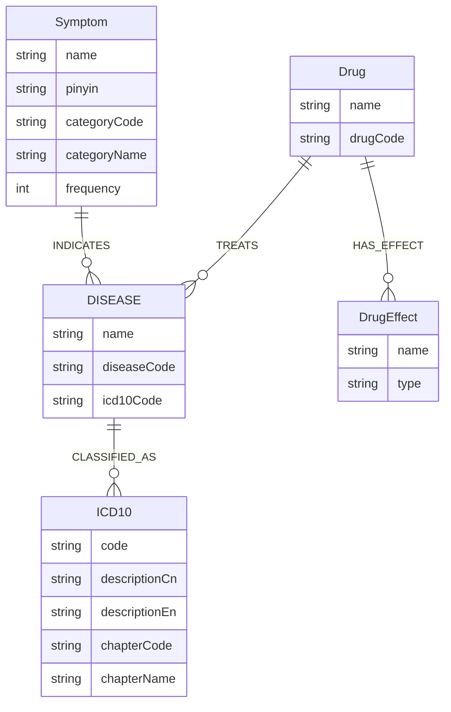
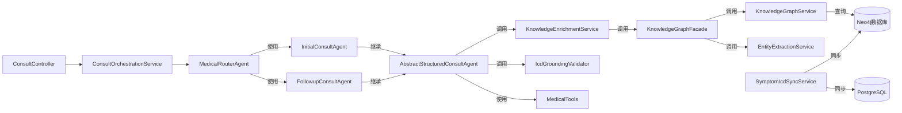

# 医疗多Agent系统 - 后端开发成果文档

**文档版本**: v1.0  
**编写日期**: 2026-05-20  
**项目名称**: 医疗多Agent系统 (Medical Multi-Agent System)  
**文档类型**: 开发成果 &amp; 技术设计文档

---

## 目录

1. [项目概述](#1-项目概述)
2. [知识图谱模块](#2-知识图谱模块)
3. [AI多Agent组件](#3-ai多agent组件)
4. [数据同步与存储层](#4-数据同步与存储层)
5. [API接口规范](#5-api接口规范)
6. [数据流程设计](#6-数据流程设计)
7. [性能优化措施](#7-性能优化措施)
8. [前端对接方案](#8-前端对接方案)
9. [系统配置与可观测性](#9-系统配置与可观测性)
10. [测试方案](#10-测试方案)

---

## 1. 项目概述

### 1.1 系统定位

本系统是一个基于Spring AI和Neo4j知识图谱的医疗多Agent智能诊断系统，主要功能包括：

- **知识图谱构建与管理**: 症状、疾病、ICD-10编码、药品等医疗实体关系图谱
- **多Agent协同**: 初诊、复诊、用药、报告解读等专业化医疗Agent
- **智能诊断**: 基于知识图谱的证据提取和ICD编码验证
- **数据同步**: Neo4j与PostgreSQL双向数据同步

### 1.2 技术栈

| 层级 | 技术选型 |
|------|---------|
| 后端框架 | Spring Boot 3.x |
| AI框架 | Spring AI, DashScope |
| 图数据库 | Neo4j 5.x |
| 关系数据库 | PostgreSQL 15.x |
| 缓存 | Redis + Redisson |
| ORM | MyBatis Plus |
| 认证 | Sa-Token |

### 1.3 整体架构图

```
┌─────────────────────────────────────────────────────────────────────────────┐
│                              前端应用层                                      │
│  ┌──────────────┐  ┌──────────────┐  ┌──────────────┐  ┌──────────────┐  │
│  │ 诊断界面    │  │ 药品管理    │  │ 预约挂号    │  │ 用户中心    │  │
│  └──────────────┘  └──────────────┘  └──────────────┘  └──────────────┘  │
└─────────────────────────────────────────────────────────────────────────────┘
                                     ↓
┌─────────────────────────────────────────────────────────────────────────────┐
│                             REST API层                                      │
│  ┌──────────────────────┐  ┌──────────────────────┐  ┌──────────────────┐ │
│  │ ConsultController    │  │ KnowledgeGraphController │  │ ...其他接口    │ │
│  └──────────────────────┘  └──────────────────────┘  └──────────────────┘ │
└─────────────────────────────────────────────────────────────────────────────┘
                                     ↓
┌─────────────────────────────────────────────────────────────────────────────┐
│                              服务层                                          │
│  ┌─────────────────────────────────────────────────────────────────────┐ │
│  │                    AI多Agent协同服务层                             │ │
│  │  ┌──────────────┐  ┌──────────────┐  ┌──────────────┐  ┌───────┐ │ │
│  │ │ InitialAgent │  │ FollowupAgent│  │ MedicationAgent│ │ ...   │ │ │
│  │ └──────────────┘  └──────────────┘  └──────────────┘  └───────┘ │ │
│  │                                                                     │ │
│  │  ┌─────────────────────────────────────────────────────────────┐  │ │
│  │  │         ConsultOrchestrationService (编排服务)             │  │ │
│  │  └─────────────────────────────────────────────────────────────┘  │ │
│  └─────────────────────────────────────────────────────────────────────┘ │
│  ┌─────────────────────────────────────────────────────────────────────┐ │
│  │                 知识图谱与AI桥接层                                   │ │
│  │  ┌──────────────┐  ┌──────────────┐  ┌──────────────┐  ┌───────┐ │ │
│  │ │ KG Facade    │  │ KG Enrichment│  │ ICD Grounding│ │ Tools │ │ │
│  │ └──────────────┘  └──────────────┘  └──────────────┘  └───────┘ │ │
│  └─────────────────────────────────────────────────────────────────────┘ │
│  ┌─────────────────────────────────────────────────────────────────────┐ │
│  │                   业务服务层                                         │ │
│  │  预约服务  │  药品服务  │  账单服务  │  用户服务  │ ...         │ │
│  └─────────────────────────────────────────────────────────────────────┘ │
└─────────────────────────────────────────────────────────────────────────────┘
                                     ↓
┌─────────────────────────────────────────────────────────────────────────────┐
│                              数据访问层                                      │
│  ┌──────────────┐  ┌──────────────┐  ┌──────────────┐  ┌──────────────┐  │
│  │  Neo4j驱动   │  │ MyBatis Plus │  │ Redis缓存    │  │  其他数据源  │  │
│  └──────────────┘  └──────────────┘  └──────────────┘  └──────────────┘  │
└─────────────────────────────────────────────────────────────────────────────┘
                                     ↓
┌─────────────────────────────────────────────────────────────────────────────┐
│                              数据存储层                                      │
│  ┌──────────────┐  ┌──────────────┐  ┌──────────────┐  ┌──────────────┐  │
│  │   Neo4j图DB  │  │ PostgreSQL   │  │    Redis     │  │  其他存储    │  │
│  └──────────────┘  └──────────────┘  └──────────────┘  └──────────────┘  │
└─────────────────────────────────────────────────────────────────────────────┘
```

---

## 2. 知识图谱模块

### 2.1 模块功能说明

知识图谱模块是整个系统的核心，负责：

| 功能类别 | 具体功能 | 说明 |
|---------|---------|-----|
| 数据导入 | CSV/JSON数据导入 | 支持批量导入医疗实体数据 |
| 图谱查询 | 症状-疾病-ICD查询 | 查询症状对应的诊断和ICD编码 |
| 实体抽取 | NLP实体提取 | 从文本中提取症状、疾病等实体 |
| 数据同步 | Neo4j ↔ PostgreSQL | 双库数据一致性保障 |
| 联想搜索 | 症状名称前缀匹配 | 支持症状名称智能提示 |
| 管理维护 | 索引/约束/清空 | 图谱管理操作 |

### 2.2 实体关系模型



### 2.3 关键实现细节

#### 2.3.1 知识图谱服务 ([KnowledgeGraphService.java](file:///d:/IDEA/multi-agent/medical-multi-agent-system/java/src/main/java/com/medical/knowledgegraph/service/neo4j/KnowledgeGraphService.java))

**核心方法**:

```java
// 症状诊断查询 - 精确匹配
List&lt;SymptomDiagnosisRow&gt; findSymptomDiagnosesRows(String symptomName);

// 症状诊断查询 - 模糊匹配
List&lt;SymptomDiagnosisRow&gt; findSymptomDiagnosesFuzzy(String keyword, int limit);

// 症状名称联想
List&lt;String&gt; suggestSymptomNames(String prefix, int limit);

// ICD编码反查
Optional&lt;SymptomDiagnosisRow&gt; lookupByIcdCode(String code);

// 导出所有症状-ICD关系
List&lt;SymptomDiagnosisRow&gt; exportAllSymptomIcdRelations();
```

**Cypher查询优化**:

```cypher
// 查询症状-疾病-ICD关系（优化版本）
MATCH (s:Symptom {name: $symptomName})
OPTIONAL MATCH (s)-[r:INDICATES]-&gt;(d:Disease)
OPTIONAL MATCH (d)-[:CLASSIFIED_AS]-&gt;(i:ICD10)
RETURN s.name AS symptom, d.name AS disease, d.diseaseCode AS diseaseCode,
       i.code AS icdCode, i.descriptionCn AS icdDescription, r.weight AS weight
ORDER BY r.priority ASC
```

#### 2.3.2 知识图谱门面服务 ([KnowledgeGraphFacade.java](file:///d:/IDEA/multi-agent/medical-multi-agent-system/java/src/main/java/com/medical/service/kg/KnowledgeGraphFacade.java))

**主要职责**:

- 整合实体提取 + 图谱查询
- 构建GraphEvidence返回给Agent
- 格式化证据文本供Prompt使用

```java
GraphEvidence extractAndQuery(String rawText);
Optional&lt;SymptomDiagnosisRow&gt; lookupIcd(String code);
String formatEvidenceText(GraphEvidence evidence);
```

#### 2.3.3 数据初始化与引导 ([KnowledgeGraphBootstrap.java](file:///d:/IDEA/multi-agent/medical-multi-agent-system/java/src/main/java/com/medical/knowledgegraph/bootstrap/KnowledgeGraphBootstrap.java))

**自动初始化流程**:

1. 启动时检测图谱是否为空
2. 如果为空，自动调用SeedData初始化
3. 预置10种常见症状及相关疾病、ICD编码
4. 创建索引提升查询性能

---

## 3. AI多Agent组件

### 3.1 Agent体系结构

```mermaid
flowchart TD
    UserInput[用户输入] --&gt; RouterAgent[MedicalRouterAgent 路由Agent]
    RouterAgent --&gt;|初诊| InitialAgent[InitialConsultAgent 初诊Agent]
    RouterAgent --&gt;|复诊| FollowupAgent[FollowupConsultAgent 复诊Agent]
    RouterAgent --&gt;|用药| MedicationAgent[MedicationAgent 用药Agent]
    RouterAgent --&gt;|报告解读| ReportAgent[ReportInterpretAgent 报告解读Agent]
    RouterAgent --&gt;|健康咨询| HealthAgent[HealthConsultAgent 健康咨询Agent]
    RouterAgent --&gt;|预约引导| AppointmentAgent[AppointmentGuideAgent 预约引导Agent]
    
    InitialAgent &amp; FollowupAgent --&gt; KG[知识图谱增强]
    KG --&gt; Evidence[GraphEvidence]
    Evidence --&gt; ICDValidation[ICD Grounding验证]
```

### 3.2 结构化咨询Agent基类 ([AbstractStructuredConsultAgent.java](file:///d:/IDEA/multi-agent/medical-multi-agent-system/java/src/main/java/com/medical/agent/AbstractStructuredConsultAgent.java))

**核心功能**:

1. **上下文增强**: 调用KnowledgeEnrichmentService获取图谱证据
2. **Prompt构建**: 自动注入graph_hit, icd_references等变量
3. **响应验证**: 对LLM输出进行ICD编码grounding验证

```java
protected abstract String getSystemPrompt();
protected void enrichAgentSpecificContext(ClinicalState state);

protected final ConsultVO structuredConsult(ClinicalState state);
```

### 3.3 知识图谱增强服务 ([KnowledgeEnrichmentService.java](file:///d:/IDEA/multi-agent/medical-multi-agent-system/java/src/main/java/com/medical/service/kg/KnowledgeEnrichmentService.java))

**支持的Agent类型**:
- INITIAL: 初诊Agent
- FOLLOWUP: 复诊Agent

**增强内容**:

| 扩展字段 | 类型 | 说明 |
|---------|------|-----|
| toolContext | String | 格式化的图谱证据文本 |
| graphEvidence | GraphEvidence | 原始图谱证据对象 |
| icdCandidateCodes | Set&lt;String&gt; | 候选ICD编码集合 |
| groundingStatus | String | grounding状态：CANDIDATES_READY / NO_HIT |
| agentTrace | List&lt;Map&gt; | Agent执行追踪日志 |

### 3.4 ICD编码验证器 ([IcdGroundingValidator.java](file:///d:/IDEA/multi-agent/medical-multi-agent-system/java/src/main/java/com/medical/service/kg/IcdGroundingValidator.java))

**验证逻辑**:

```java
// 从LLM响应中提取ICD编码
Set&lt;String&gt; extractIcdFromResult(Map&lt;String, Object&gt; consultResult);

// 比对ICD编码与候选白名单
boolean allValid = icdCandidateCodes.containsAll(mentionedIcdCodes);

// 设置grounding状态
if (candidates.isEmpty()) {
    status = "NO_HIT";
} else if (allValid) {
    status = "VERIFIED";
} else {
    status = "WARNING"; // 有未验证的ICD
}
```

### 3.5 医疗工具类 ([MedicalTools.java](file:///d:/IDEA/multi-agent/medical-multi-agent-system/java/src/main/java/com/medical/tools/MedicalTools.java))

**可供Agent调用的工具**:

| 工具方法 | 说明 | 优先数据源 |
|---------|-----|-----------|
| querySymptomDiagnosis | 查询症状诊断 | 知识图谱 |
| suggestSymptoms | 症状名称联想 | 知识图谱 |
| lookupIcd10 | ICD编码查询 | 优先图谱，其次RDB |
| checkDrugInteraction | 药物相互作用检查 | RDB |

### 3.6 咨询编排服务 ([ConsultOrchestrationService.java](file:///d:/IDEA/multi-agent/medical-multi-agent-system/java/src/main/java/com/medical/service/ConsultOrchestrationService.java))

**同步模式**:

```java
ConsultVO consultSync(String sessionId, String userMessage);
```

**流式模式**:

```java
Flux&lt;String&gt; consultStream(String sessionId, String userMessage);
```

---

## 4. 数据同步与存储层

### 4.1 双库架构设计

```
┌─────────────────────────────────────────────────────────────────┐
│                      医疗数据架构                              │
│                                                                 │
│  ┌──────────────────────────────────────────────────────────┐  │
│  │  Neo4j (权威数据源)                                   │  │
│  │  - 症状-疾病-ICD关系网络                              │  │
│  │  - 药品-适应症关系                                     │  │
│  │  - 复杂查询路径遍历                                     │  │
│  └──────────────────┬───────────────────────────────────────┘  │
│                     ↓ 同步                                  │
│  ┌──────────────────┴───────────────────────────────────────┐  │
│  │  SymptomIcdSyncService (同步服务)                      │  │
│  │  - 增量同步检测                                        │  │
│  │  - 冲突解决策略                                        │  │
│  └──────────────────┬───────────────────────────────────────┘  │
│                     ↓ 写入                                  │
│  ┌──────────────────┴───────────────────────────────────────┐  │
│  │  PostgreSQL (高可用数据源)                             │  │
│  │  - symptom (症状表)                                     │  │
│  │  - icd10_code (ICD编码表)                              │  │
│  │  - symptom_icd_rel (关联表)                             │  │
│  └──────────────────────────────────────────────────────────┘  │
└─────────────────────────────────────────────────────────────────┘
```

### 4.2 同步服务实现 ([SymptomIcdSyncService.java](file:///d:/IDEA/multi-agent/medical-multi-agent-system/java/src/main/java/com/medical/service/sync/SymptomIcdSyncService.java))

**同步策略**:

```java
int syncFromNeo4j();

// 逻辑：
// 1. 从Neo4j导出所有SymptomDiagnosisRow
// 2. 对每个关系：
//    - 如果不存在则插入
//    - 如果已存在则更新
//    - 如果ICD编码为空则跳过
```

### 4.3 数据模型

#### 4.3.1 Neo4j实体模型

见[2.2实体关系模型](#22-实体关系模型)

#### 4.3.2 PostgreSQL表结构

| 表名 | 说明 | 主要字段 |
|-----|-----|---------|
| symptom | 症状表 | id, name, pinyin, category_code, category_name, frequency |
| icd10_code | ICD-10编码表 | id, code, description_cn, description_en, chapter_code, chapter_name |
| symptom_icd_rel | 症状-ICD关联表 | id, symptom_name, disease_name, disease_code, icd_code, icd_description, weight, priority |

---

## 5. API接口规范

### 5.1 知识图谱API ([KnowledgeGraphController.java](file:///d:/IDEA/multi-agent/medical-multi-agent-system/java/src/main/java/com/medical/knowledgegraph/controller/KnowledgeGraphController.java))

#### 5.1.1 健康检查

```
GET /api/knowledge-graph/health

Response:
{
  "status": "UP",
  "service": "Knowledge Graph Service"
}
```

#### 5.1.2 症状名称联想

```
GET /api/knowledge-graph/symptoms/suggest?prefix=头&amp;limit=10

Response:
[
  "头痛",
  "头晕",
  "头皮痛",
  ...
]
```

#### 5.1.3 症状诊断查询

```
GET /api/knowledge-graph/diagnosis/{symptomName}

Response: QueryResultDTO
{
  "columns": ["symptom", "disease", "icdCode", ...],
  "records": [...]
}
```

#### 5.1.4 数据同步

```
POST /api/knowledge-graph/sync-to-rdb

Response:
{
  "syncedRelations": 156,
  "message": "同步完成"
}
```

#### 5.1.5 统计信息

```
GET /api/knowledge-graph/statistics

Response:
{
  "Symptom": 10,
  "Disease": 25,
  "ICD10": 30,
  "Drug": 15,
  "Relationships": 60
}
```

### 5.2 咨询API

#### 5.2.1 同步咨询

```
POST /api/consult/sync
{
  "sessionId": "uuid",
  "userMessage": "我最近总是头痛"
}

Response: ConsultVO
{
  "message": "...",
  "graphHit": true,
  "graphEvidence": { ... },
  "groundingStatus": "CANDIDATES_READY",
  "agentTrace": [ ... ]
}
```

#### 5.2.2 流式咨询

```
POST /api/consult/stream
{
  "sessionId": "uuid",
  "userMessage": "我最近总是头痛"
}

Response: SSE (text/event-stream)
- data: {"type":"toolContext","content":"【知识图谱检索结果】..."}
- data: {"type":"delta","content":"根据您描述的症状..."}
- data: {"type":"done","content":"DONE"}
```

---

## 6. 数据流程设计

### 6.1 完整咨询流程图

```mermaid
sequenceDiagram
    participant User as 用户
    participant FE as 前端
    participant API as ConsultController
    participant Orchestrator as ConsultOrchestrationService
    participant Router as MedicalRouterAgent
    participant Agent as InitialConsultAgent
    participant Enrichment as KnowledgeEnrichmentService
    participant KG as KnowledgeGraphFacade
    participant Neo4j as Neo4j
    participant Grounding as IcdGroundingValidator
    participant Memory as ChatMemory

    User-&gt;&gt;FE: 输入症状："我最近总是头痛"
    FE-&gt;&gt;API: POST /api/consult/sync
    API-&gt;&gt;Orchestrator: consultSync(sessionId, message)
    
    Orchestrator-&gt;&gt;Memory: 获取历史对话
    Memory--&gt;&gt;Orchestrator: 返回历史记录
    
    Orchestrator-&gt;&gt;Router: 选择Agent
    Router--&gt;&gt;Orchestrator: 返回InitialAgent
    
    Orchestrator-&gt;&gt;Agent: 执行consult
    Agent-&gt;&gt;Enrichment: enrich(state, INITIAL)
    
    Enrichment-&gt;&gt;KG: extractAndQuery(rawText)
    KG-&gt;&gt;KG: 提取症状实体
    KG-&gt;&gt;Neo4j: 查询症状-疾病-ICD关系
    Neo4j--&gt;&gt;KG: 返回SymptomDiagnosisRow列表
    KG--&gt;&gt;Enrichment: 返回GraphEvidence
    
    Enrichment-&gt;&gt;Enrichment: 构建toolContext
    Enrichment-&gt;&gt;Enrichment: 添加agentTrace
    Enrichment--&gt;&gt;Agent: 返回增强后的ClinicalState
    
    Agent-&gt;&gt;Agent: 构建Prompt（注入graph_hit等）
    Agent-&gt;&gt;Agent: 调用LLM生成响应
    
    Agent-&gt;&gt;Grounding: 验证ICD编码
    Grounding-&gt;&gt;Grounding: 检查ICD是否在候选集
    Grounding--&gt;&gt;Agent: 返回验证状态
    
    Agent--&gt;&gt;Orchestrator: 返回ConsultVO
    Orchestrator-&gt;&gt;Memory: 保存对话
    Orchestrator--&gt;&gt;API: 返回ConsultVO
    API--&gt;&gt;FE: 渲染诊断结果
    FE--&gt;&gt;User: 显示AI建议
```

### 6.2 图谱命中场景的数据流转

当用户输入被知识图谱命中时：

```
用户输入: "我头痛"
       ↓
[步骤1] EntityExtractionService提取症状
       ↓ ["头痛"]
[步骤2] KnowledgeGraphService查询
       ↓
症状: 头痛
  └─&gt; 疾病: 偏头痛 (weight: 1.0)
       └─&gt; ICD: G43.909 (偏头痛，未特指)
  └─&gt; 疾病: 紧张型头痛 (weight: 0.8)
       └─&gt; ICD: G44.209 (紧张型头痛，未特指)
       ↓
[步骤3] 构建GraphEvidence
  - graphHit: true
  - rows: [SymptomDiagnosisRow, ...]
  - icdCandidateCodes: ["G43.909", "G44.209"]
  - formattedText: "【知识图谱检索结果】..."
       ↓
[步骤4] 注入Prompt
  - graph_hit = true
  - icd_references = ["G43.909", "G44.209"]
       ↓
[步骤5] LLM生成响应
       ↓
[步骤6] ICD Grounding验证
  - 检查LLM输出的ICD是否在候选集
  - 如果全部匹配 → VERIFIED
  - 如果部分不匹配 → WARNING
```

### 6.3 图谱未命中场景的安全机制

当用户输入无法被知识图谱匹配时：

```
用户输入: "我感觉非常不舒服"
       ↓
[步骤1] EntityExtractionService未找到匹配症状
       ↓
[步骤2] GraphEvidence.graphHit = false
       ↓
[步骤3] Prompt注入：
  - graph_hit = false
  - 特殊指令: "图谱未命中，请勿编造ICD编码"
       ↓
[步骤4] LLM生成通用建议
       ↓
[步骤5] groundingStatus = NO_HIT
```

---

## 7. 性能优化措施

### 7.1 索引优化

#### Neo4j索引策略

```cypher
// 节点名称索引（用于快速查找）
CREATE INDEX idx_symptom_name FOR (s:Symptom) ON (s.name);
CREATE INDEX idx_disease_name FOR (d:Disease) ON (d.name);
CREATE INDEX idx_icd_code FOR (i:ICD10) ON (i.code);

// 约束（保证唯一性）
CREATE CONSTRAINT unique_symptom_name FOR (s:Symptom) REQUIRE s.name IS UNIQUE;
CREATE CONSTRAINT unique_icd_code FOR (i:ICD10) REQUIRE i.code IS UNIQUE;
```

### 7.2 缓存策略

#### 缓存架构

```
应用层
   ↓
Redis缓存
   ↓ (缓存未命中)
PostgreSQL
   ↓ (复杂查询)
Neo4j
```

#### 缓存键设计 ([RedisKeyConstant.java](file:///d:/IDEA/multi-agent/medical-multi-agent-system/java/src/main/java/com/medical/constant/RedisKeyConstant.java))

| 缓存键 | 类型 | TTL | 说明 |
|-------|------|-----|-----|
| symptom:suggest:{prefix} | List&lt;String&gt; | 1h | 症状联想结果 |
| symptom:diagnosis:{name} | List&lt;SymptomDiagnosisRow&gt; | 2h | 症状诊断查询 |
| icd:lookup:{code} | Optional&lt;SymptomDiagnosisRow&gt; | 2h | ICD反查结果 |
| kg:statistics | Map&lt;String, Long&gt; | 5m | 统计信息 |

### 7.3 查询优化

#### 7.3.1 Cypher查询优化

**优化前**:
```cypher
MATCH (s:Symptom)-[*1..2]-(d:Disease)-[*1..2]-(i:ICD10)
WHERE s.name = $name
RETURN *
```

**优化后**:
```cypher
MATCH (s:Symptom {name: $symptomName})
OPTIONAL MATCH (s)-[r:INDICATES]-&gt;(d:Disease)
OPTIONAL MATCH (d)-[:CLASSIFIED_AS]-&gt;(i:ICD10)
USING INDEX s:Symptom(name)
RETURN s.name AS symptom, d.name AS disease, i.code AS icdCode, r.weight AS weight
ORDER BY r.priority ASC
```

#### 7.3.2 批量查询优化

对于症状联想查询，使用前缀匹配优化：

```java
// 使用STARTS WITH而非CONTAINS
List&lt;String&gt; suggestSymptomNames(String prefix, int limit) {
    return Values.value(prefix + "%") // 使用前缀匹配
        // ...
}
```

### 7.4 缓存预热

在[CacheWarmupTask.java](file:///d:/IDEA/multi-agent/medical-multi-agent-system/java/src/main/java/com/medical/task/CacheWarmupTask.java)中实现启动时缓存预热：

- 热门症状诊断预加载
- ICD编码数据预加载
- 统计信息预计算

---

## 8. 前端对接方案

### 8.1 前端页面映射

| 功能模块 | 页面路径 | 后端接口 |
|---------|---------|---------|
| 智能诊断首页 | /consult | GET /api/consult/sessions, POST /api/consult/sync |
| 症状联想提示 | 组件内联 | GET /api/knowledge-graph/symptoms/suggest |
| 诊断详情展示 | /consult/:id | GET /api/consult/:id |
| 知识图谱可视化 | /graph | GET /api/knowledge-graph/statistics, /diagnosis/* |
| 数据管理后台 | /admin | 各种管理接口 |

### 8.2 ConsultVO数据结构 ([ConsultVO.java](file:///d:/IDEA/multi-agent/medical-multi-agent-system/java/src/main/java/com/medical/model/vo/ConsultVO.java))

```json
{
  "message": "根据您描述的症状，考虑...",
  "agentType": "INITIAL",
  "graphHit": true,
  "groundingStatus": "VERIFIED",
  "graphEvidence": {
    "rows": [
      {
        "symptom": "头痛",
        "disease": "偏头痛",
        "diseaseCode": "D_G43",
        "icdCode": "G43.909",
        "icdDescription": "偏头痛，未特指",
        "weight": 1.0,
        "priority": 1
      }
    ],
    "extractedSymptoms": ["头痛"],
    "icdCandidateCodes": ["G43.909", "G44.209"],
    "graphHit": true,
    "queryTimeMs": 50,
    "formattedText": "【知识图谱检索结果】\n1. 症状: 头痛 | 可能疾病: 偏头痛 | ICD: G43.909..."
  },
  "agentTrace": [
    {
      "agent": "KnowledgeGraph",
      "action": "enrich",
      "timestamp": 1234567890
    }
  ]
}
```

### 8.3 前端显示建议

#### 8.3.1 图谱命中指示器

根据`graphHit`和`groundingStatus`显示不同状态：

```jsx
// 示例（React）
const GraphStatusBadge = ({ graphHit, groundingStatus }) =&gt; {
  const getStatusStyle = () =&gt; {
    if (!graphHit) return { color: 'gray', text: '图谱未命中' };
    switch (groundingStatus) {
      case 'VERIFIED': return { color: 'green', text: 'ICD验证通过' };
      case 'CANDIDATES_READY': return { color: 'blue', text: '图谱已命中' };
      case 'WARNING': return { color: 'orange', text: '部分ICD未验证' };
      default: return { color: 'gray', text: '状态未知' };
    }
  };
  
  const style = getStatusStyle();
  return &lt;span style={{ color: style.color }}&gt;{style.text}&lt;/span&gt;;
};
```

#### 8.3.2 知识图谱证据展示组件

```jsx
const GraphEvidencePanel = ({ graphEvidence }) =&gt; {
  if (!graphEvidence?.graphHit) return null;
  
  return (
    &lt;div className="graph-evidence-panel"&gt;
      &lt;h4&gt;📊 知识图谱检索结果 ({graphEvidence.queryTimeMs}ms)&lt;/h4&gt;
      &lt;div className="symptoms"&gt;
        提取症状: {graphEvidence.extractedSymptoms.join(', ')}
      &lt;/div&gt;
      &lt;table&gt;
        &lt;thead&gt;
          &lt;tr&gt;
            &lt;th&gt;症状&lt;/th&gt;
            &lt;th&gt;可能疾病&lt;/th&gt;
            &lt;th&gt;ICD编码&lt;/th&gt;
            &lt;th&gt;优先级&lt;/th&gt;
          &lt;/tr&gt;
        &lt;/thead&gt;
        &lt;tbody&gt;
          {graphEvidence.rows.map((row, i) =&gt; (
            &lt;tr key={i}&gt;
              &lt;td&gt;{row.symptom}&lt;/td&gt;
              &lt;td&gt;{row.disease}&lt;/td&gt;
              &lt;td&gt;
                &lt;span className="icd-code"&gt;{row.icdCode}&lt;/span&gt;
                &lt;div className="icd-desc"&gt;{row.icdDescription}&lt;/div&gt;
              &lt;/td&gt;
              &lt;td&gt;{row.priority}&lt;/td&gt;
            &lt;/tr&gt;
          ))}
        &lt;/tbody&gt;
      &lt;/table&gt;
      &lt;details&gt;
        &lt;summary&gt;查看原始证据文本&lt;/summary&gt;
        &lt;pre&gt;{graphEvidence.formattedText}&lt;/pre&gt;
      &lt;/details&gt;
    &lt;/div&gt;
  );
};
```

### 8.4 流式响应处理

```javascript
// 流式咨询调用示例
async function consultStream(sessionId, message) {
  const response = await fetch('/api/consult/stream', {
    method: 'POST',
    headers: { 'Content-Type': 'application/json' },
    body: JSON.stringify({ sessionId, userMessage: message })
  });
  
  const reader = response.body.getReader();
  const decoder = new TextDecoder();
  let fullMessage = '';
  
  while (true) {
    const { done, value } = await reader.read();
    if (done) break;
    
    const chunk = decoder.decode(value);
    const lines = chunk.split('\n');
    
    for (const line of lines) {
      if (!line.startsWith('data: ')) continue;
      const data = JSON.parse(line.slice(6));
      
      switch (data.type) {
        case 'toolContext':
          showToolContext(data.content);
          break;
        case 'delta':
          fullMessage += data.content;
          updateMessageDisplay(fullMessage);
          break;
        case 'done':
          finalizeMessage();
          break;
      }
    }
  }
}
```

---

## 9. 系统配置与可观测性

### 9.1 配置项

#### MedicalGraphProperties ([MedicalGraphProperties.java](file:///d:/IDEA/multi-agent/medical-multi-agent-system/java/src/main/java/com/medical/config/MedicalGraphProperties.java))

```yaml
medical:
  graph:
    enabled: true              # 是否启用知识图谱
    pre-enrich: true           # 是否预增强上下文
    fuzzy-symptom-limit: 20    # 模糊匹配限制
    validate-icd: true         # 是否验证ICD编码
```

### 9.2 日志配置

#### 关键日志点

| 操作 | 日志级别 | 日志内容 |
|-----|---------|---------|
| 查询执行 | INFO | `执行Cypher查询: {cypher}` |
| 症状提取 | INFO | `从文本中提取实体: {text}` |
| 图谱命中 | DEBUG | `Graph hit: {symptoms}, ICD: {icdCodes}` |
| ICD验证 | WARN | `未在图谱候选中的ICD: {invalidCodes}` |
| 同步操作 | INFO | `同步完成: {count}条关系` |

### 9.3 Agent追踪

通过`ClinicalState`的`agentTrace`字段记录完整调用链：

```java
[
  {
    "agent": "KnowledgeGraph",
    "action": "enrich",
    "timestamp": 1716172800000,
    "symptomsExtracted": ["头痛"],
    "icdCount": 2
  },
  {
    "agent": "IcdGroundingValidator",
    "action": "validate",
    "timestamp": 1716172801000,
    "status": "VERIFIED"
  }
]
```

---

## 10. 测试方案

### 10.1 测试覆盖范围

#### 10.1.1 单元测试

| 测试类 | 文件路径 | 测试内容 |
|-------|---------|---------|
| KnowledgeGraphServiceTest | [KnowledgeGraphServiceTest.java](file:///d:/IDEA/multi-agent/medical-multi-agent-system/java/src/test/java/com/medical/knowledgegraph/service/neo4j/KnowledgeGraphServiceTest.java) | 症状查询、模糊匹配、联想搜索、ICD反查、统计查询 |
| SymptomIcdSyncServiceTest | [SymptomIcdSyncServiceTest.java](file:///d:/IDEA/multi-agent/medical-multi-agent-system/java/src/test/java/com/medical/service/sync/SymptomIcdSyncServiceTest.java) | 数据同步逻辑、空处理、更新冲突处理 |
| KnowledgeEnrichmentServiceTest | [KnowledgeEnrichmentServiceTest.java](file:///d:/IDEA/multi-agent/medical-multi-agent-system/java/src/test/java/com/medical/service/kg/KnowledgeEnrichmentServiceTest.java) | Agent支持判断、上下文增强、状态设置 |
| IcdGroundingValidatorTest | [IcdGroundingValidatorTest.java](file:///d:/IDEA/multi-agent/medical-multi-agent-system/java/src/test/java/com/medical/service/kg/IcdGroundingValidatorTest.java) | ICD编码提取、验证逻辑、状态设置 |
| MedicalToolsTest | [MedicalToolsTest.java](file:///d:/IDEA/multi-agent/medical-multi-agent-system/java/src/test/java/com/medical/tools/MedicalToolsTest.java) | 工具方法调用、数据源优先级 |

#### 10.1.2 API测试（APIFox）

**P0接口测试用例**:

| 接口 | 测试场景 | 预期结果 |
|-----|---------|---------|
| POST /sync-to-rdb | 空数据库同步 | 成功导入10种症状关系 |
| POST /sync-to-rdb | 已存在数据同步 | 正确更新，无重复 |
| GET /symptoms/suggest?prefix=头 | 前缀联想 | 返回["头痛","头晕",...] |
| GET /diagnosis/头痛 | 正常查询 | 返回偏头痛、紧张型头痛等 |
| GET /diagnosis/不存在 | 无效查询 | 返回空结果 |

#### 10.1.3 端到端测试

**核心场景**:

1. **初诊流程**
   - 输入: "我最近总是头痛，有时候会恶心"
   - 预期: 图谱命中，返回包含ICD的诊断建议

2. **复诊流程**
   - 上下文: 已有初诊记录
   - 输入: "昨天开的药吃了还是痛"
   - 预期: Agent理解上下文，调整诊断

3. **ICD验证流程**
   - 测试各种grounding状态: VERIFIED, WARNING, NO_HIT

### 10.2 测试数据准备

**SeedData预置的10种症状**:
1. 头痛
2. 发热
3. 咳嗽
4. 腹痛
5. 胸痛
6. 背痛
7. 关节痛
8. 皮疹
9. 恶心
10. 疲劳

---

## 附录

### A. 文件结构速览

```
medical-multi-agent-system/java/src/main/java/com/medical/
├── agent/                              # AI Agent层
│   ├── MedicalAgentType.java           # Agent类型枚举
│   ├── AbstractStructuredConsultAgent.java  # 结构化咨询Agent基类
│   ├── InitialConsultAgent.java        # 初诊Agent
│   ├── FollowupConsultAgent.java       # 复诊Agent
│   ├── MedicationAgent.java            # 用药Agent
│   ├── ReportInterpretAgent.java       # 报告解读Agent
│   ├── HealthConsultAgent.java         # 健康咨询Agent
│   ├── AppointmentGuideAgent.java      # 预约引导Agent
│   └── MedicalRouterAgent.java         # 路由Agent
│
├── knowledgegraph/                     # 知识图谱模块
│   ├── config/                         # 配置
│   │   ├── Neo4jConfig.java
│   │   └── Neo4jProperties.java
│   ├── controller/
│   │   └── KnowledgeGraphController.java
│   ├── model/
│   │   ├── entity/                     # 图实体
│   │   │   ├── Symptom.java
│   │   │   ├── Disease.java
│   │   │   ├── IcdCode.java
│   │   │   ├── Drug.java
│   │   │   └── KnowledgeRelation.java
│   │   └── dto/
│   │       ├── SymptomDiagnosisRow.java
│   │       ├── QueryResultDTO.java
│   │       └── ImportTaskDTO.java
│   ├── service/
│   │   ├── neo4j/
│   │   │   └── KnowledgeGraphService.java
│   │   ├── extraction/
│   │   │   └── EntityExtractionService.java
│   │   └── datainput/
│   │       ├── DataImportService.java
│   │       ├── CsvImportService.java
│   │       └── JsonImportService.java
│   └── bootstrap/
│       ├── KnowledgeGraphBootstrap.java
│       └── KnowledgeGraphSeedData.java
│
├── service/                            # 业务服务层
│   ├── kg/                             # 知识图谱桥接
│   │   ├── KnowledgeGraphFacade.java
│   │   ├── KnowledgeEnrichmentService.java
│   │   └── IcdGroundingValidator.java
│   ├── sync/
│   │   └── SymptomIcdSyncService.java
│   ├── ConsultOrchestrationService.java
│   ├── ConsultMemoryService.java
│   └── ...
│
├── tools/                              # Agent工具
│   └── MedicalTools.java
│
├── model/                              # 数据模型
│   ├── vo/
│   │   ├── ConsultVO.java
│   │   ├── SymptomDiagnosisRowVO.java
│   │   └── ...
│   ├── entity/                         # RDB实体
│   │   ├── SymptomEntity.java
│   │   ├── Icd10CodeEntity.java
│   │   ├── SymptomIcdRelEntity.java
│   │   └── ...
│   ├── ClinicalState.java
│   └── kg/
│       └── GraphEvidence.java
│
└── config/                             # 配置
    ├── MedicalGraphProperties.java
    ├── MedicalAiProperties.java
    └── ...
```

### B. 核心类依赖关系



### C. 联系与支持

如有问题，请联系技术团队。

---

**文档结束**
